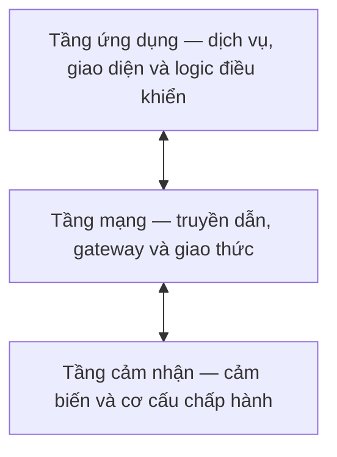
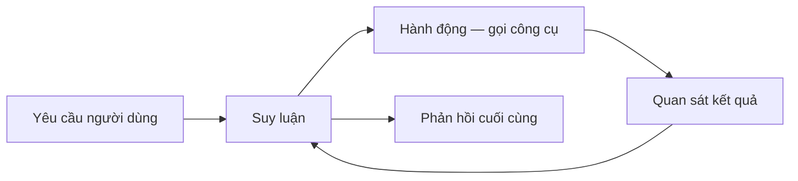
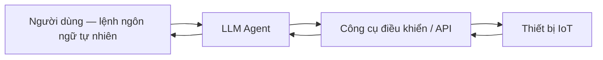
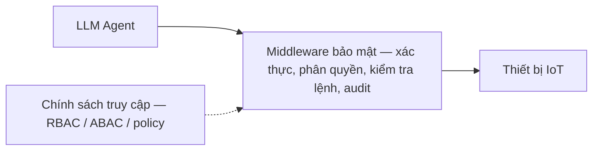
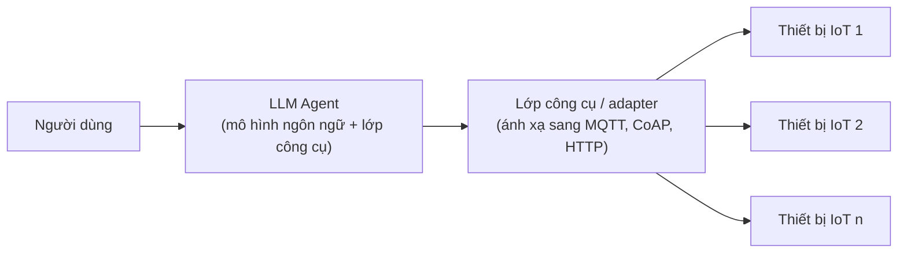
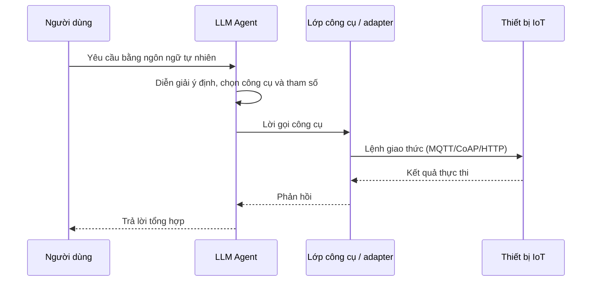
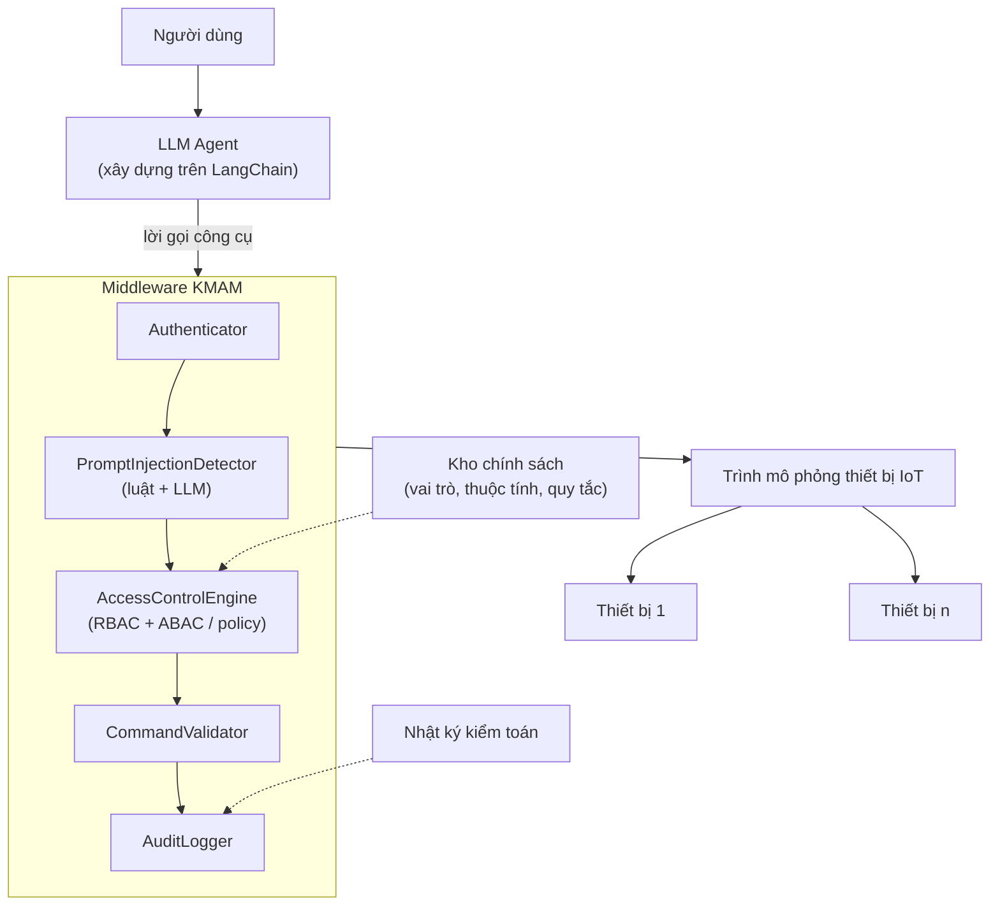
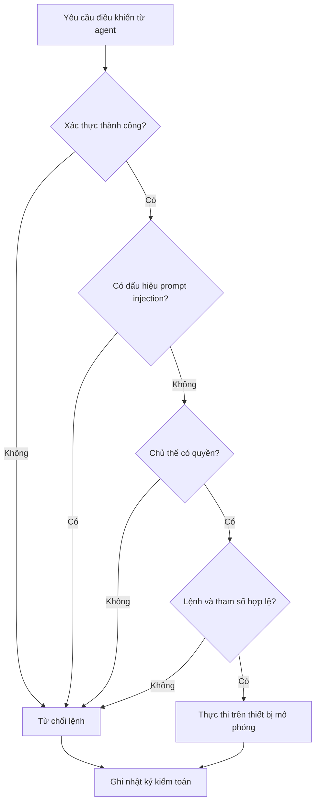
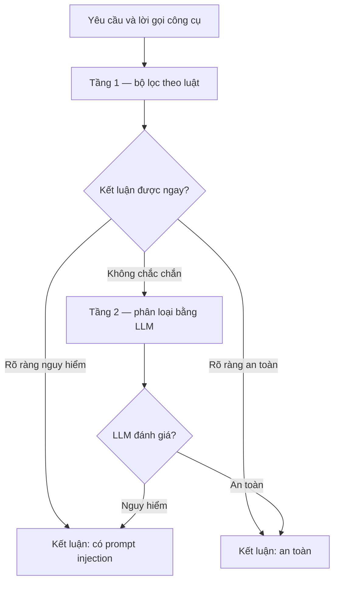

# XÁC NHẬN CỦA GIẢNG VIÊN HƯỚNG DẪN

Nhận xét:

......................................................................................................

......................................................................................................

......................................................................................................

......................................................................................................

......................................................................................................

......................................................................................................

*Hà Nội, ngày ... tháng ... năm 2026*

Giảng viên hướng dẫn

*(Ký và ghi rõ họ tên)*

**PGS. TS. Trần Thị Lượng**

# LỜI NÓI ĐẦU

Sự phát triển nhanh chóng của Internet vạn vật (Internet of Things - IoT) đã đưa các thiết bị
điều khiển thông minh vào hầu hết mọi lĩnh vực của đời sống, từ nhà thông minh, nhà máy thông
minh cho tới y tế thông minh. Song song với đó, sự xuất hiện của các mô hình ngôn ngữ lớn
(Large Language Model - LLM) và đặc biệt là kiến trúc LLM Agent đã mở ra một hướng tiếp cận mới
cho việc điều khiển thiết bị: người dùng có thể ra lệnh bằng ngôn ngữ tự nhiên, còn agent đảm
nhận việc suy luận và điều phối thiết bị. Tuy nhiên, chính khả năng tự động hóa mạnh mẽ này lại
làm phát sinh những rủi ro an toàn thông tin mới, trong đó nổi bật là tấn công tiêm nhiễm chỉ
thị (prompt injection), lạm dụng công cụ (tool misuse) và leo thang đặc quyền thông qua agent.
Khi một agent có quyền điều khiển trực tiếp thiết bị IoT, một chỉ thị độc hại được chèn khéo léo
có thể bị chuyển hóa thành hành vi điều khiển trái phép trong thế giới vật lý.

Xuất phát từ thực tế đó, báo cáo này tập trung nghiên cứu các nguy cơ an toàn thông tin trong hệ
thống điều khiển thiết bị IoT sử dụng LLM Agent, từ đó đề xuất và xây dựng thử nghiệm một mô
hình middleware bảo mật đóng vai trò trung gian kiểm soát truy cập giữa LLM Agent và thiết bị
IoT. Middleware được thiết kế nhằm xác thực agent, kiểm soát quyền truy cập thiết bị theo các mô
hình kiểm soát truy cập phổ biến (RBAC, ABAC, policy-based) và phát hiện các chỉ thị bất thường,
góp phần nâng cao mức độ an toàn cho hệ thống điều khiển thông minh.

Nội dung báo cáo được tổ chức thành ba chương. Chương I trình bày tổng quan về hệ thống điều
khiển IoT sử dụng LLM Agent cùng các rủi ro an toàn thông tin liên quan. Chương II phân tích yêu
cầu bảo mật và các mô hình kiểm soát truy cập áp dụng cho hệ thống. Chương III - chương đóng góp
chính - đề xuất kiến trúc middleware bảo mật, xây dựng thử nghiệm trong môi trường mô phỏng và
đánh giá hiệu quả của mô hình đề xuất.

Em xin gửi lời cảm ơn chân thành và sâu sắc nhất tới giảng viên hướng dẫn, **PGS. TS. Trần Thị
Lượng**, người đã tận tình định hướng, góp ý và hỗ trợ em trong suốt quá trình thực hiện đề tài.
Do kiến thức và thời gian còn hạn chế, báo cáo khó tránh khỏi những thiếu sót. Em rất mong nhận
được sự góp ý của quý thầy cô để đề tài được hoàn thiện hơn.

Em xin chân thành cảm ơn!

*Hà Nội, tháng 6 năm 2026*

Sinh viên thực hiện

**Nguyễn Công Thành** — CHAT12142

# CHƯƠNG I. TỔNG QUAN HỆ THỐNG ĐIỀU KHIỂN IoT SỬ DỤNG LLM AGENT VÀ CÁC RỦI RO AN TOÀN THÔNG TIN

Chương này trình bày tổng quan về hệ thống điều khiển thiết bị IoT có sự tham gia của LLM Agent.
Nội dung làm rõ các thành phần và kiến trúc cơ bản của hệ thống IoT, đặc điểm cùng vai trò của
LLM Agent trong việc điều phối thiết bị, sau đó phân tích các nguy cơ an toàn thông tin phát
sinh và lý giải sự cần thiết của một lớp middleware bảo mật. Đây là nền tảng cho phần phân tích
yêu cầu ở Chương II và mô hình đề xuất ở Chương III.

## 1.1. Tổng quan hệ thống Internet of Things (IoT)

### 1.1.1. Khái niệm hệ thống IoT

Internet vạn vật (Internet of Things - IoT) được Liên minh Viễn thông Quốc tế định nghĩa là một
hạ tầng toàn cầu cho xã hội thông tin, cho phép cung cấp các dịch vụ tiên tiến bằng cách kết nối
liên thông các "vật" (things) cả vật lý lẫn ảo dựa trên các công nghệ thông tin và truyền thông
hiện có và đang phát triển [2]. Theo nghĩa rộng hơn, IoT là mạng lưới các đối tượng vật lý được
nhúng cảm biến, phần mềm và khả năng kết nối nhằm thu thập và trao đổi dữ liệu, từ đó hỗ trợ
giám sát và điều khiển từ xa [1].

Một hệ thống IoT điển hình gồm bốn nhóm thành phần chính. Thứ nhất là các thiết bị đầu cuối
(things) bao gồm cảm biến (sensor) để thu thập dữ liệu và cơ cấu chấp hành (actuator) để tác
động lên môi trường vật lý. Thứ hai là hạ tầng kết nối (connectivity) đảm nhận việc truyền dữ
liệu qua các giao thức như MQTT, CoAP hay HTTP. Thứ ba là nền tảng xử lý (platform) thực hiện
lưu trữ, phân tích và quản lý thiết bị. Thứ tư là tầng ứng dụng (application) cung cấp giao diện
và dịch vụ cho người dùng cuối.

### 1.1.2. Kiến trúc hệ thống điều khiển thiết bị IoT

Kiến trúc phổ biến nhất của hệ thống IoT là mô hình ba tầng gồm tầng cảm nhận (perception
layer), tầng mạng (network layer) và tầng ứng dụng (application layer) [1]. Tầng cảm nhận chứa
các thiết bị thu thập dữ liệu và thực thi lệnh điều khiển. Tầng mạng đảm nhận truyền dẫn và định
tuyến dữ liệu thông qua các gateway. Tầng ứng dụng cung cấp logic nghiệp vụ và giao diện điều
khiển. Trong nhiều tài liệu, mô hình này được mở rộng thành bốn hoặc năm tầng để tách riêng tầng
xử lý và tầng nghiệp vụ.

<em>Hình 1.1. Mô hình kiến trúc ba tầng của hệ thống IoT</em>

Xét theo mô hình triển khai, hệ thống điều khiển IoT thường được tổ chức theo ba hướng. Kiến
trúc hướng đám mây (cloud-based) tập trung xử lý và ra quyết định trên máy chủ đám mây, phù hợp
với khả năng mở rộng nhưng phụ thuộc vào kết nối mạng và có độ trễ cao. Kiến trúc hướng biên
(edge-based) đẩy phần xử lý về gần thiết bị nhằm giảm độ trễ và tăng quyền riêng tư. Kiến trúc
lai (hybrid) kết hợp hai hướng trên, xử lý tác vụ nhạy độ trễ ở biên và giao các tác vụ phức tạp
cho đám mây.

### 1.1.3. Các ứng dụng điều khiển IoT trong thực tế

Điều khiển IoT đã được ứng dụng rộng rãi trong nhiều lĩnh vực. Trong nhà thông minh (smart
home), người dùng điều khiển đèn, khóa cửa, điều hòa và các thiết bị gia dụng từ xa. Trong nhà
máy thông minh (smart factory), hệ thống giám sát dây chuyền sản xuất và thực hiện bảo trì dự
đoán dựa trên dữ liệu cảm biến. Trong y tế thông minh (smart healthcare), các thiết bị theo dõi
sức khỏe và thiết bị y tế kết nối hỗ trợ giám sát bệnh nhân liên tục. Điểm chung của các ứng
dụng này là khả năng điều khiển thiết bị từ xa, đồng thời cũng chính là bề mặt tấn công cần được
bảo vệ chặt chẽ.

## 1.2. Tổng quan mô hình LLM Agent trong hệ thống điều khiển

### 1.2.1. Khái niệm mô hình ngôn ngữ lớn (LLM)

Mô hình ngôn ngữ lớn (Large Language Model - LLM) là loại mô hình học sâu được huấn luyện trên
khối lượng dữ liệu văn bản khổng lồ nhằm hiểu và sinh ngôn ngữ tự nhiên. Phần lớn các LLM hiện
đại dựa trên kiến trúc Transformer với cơ chế tự chú ý (self-attention) [3]. Khi quy mô tham số
và dữ liệu huấn luyện tăng lên, các mô hình này thể hiện khả năng học theo ngữ cảnh (in-context
learning) và giải quyết nhiều tác vụ chỉ với một vài ví dụ mẫu [4]. Đặc điểm quan trọng đối với
bài toán điều khiển là khả năng suy luận nhiều bước và diễn giải ý định của người dùng từ ngôn
ngữ tự nhiên, tạo tiền đề cho việc xây dựng các agent có khả năng hành động.

### 1.2.2. Kiến trúc LLM Agent

LLM Agent là hệ thống lấy LLM làm bộ phận suy luận trung tâm, được bổ sung khả năng sử dụng công
cụ (tool use) và bộ nhớ để có thể tương tác với môi trường bên ngoài. Thay vì chỉ sinh văn bản,
agent có thể quyết định gọi một công cụ, quan sát kết quả trả về và tiếp tục suy luận cho tới khi
hoàn thành nhiệm vụ. Mô hình ReAct (Reasoning and Acting) kết hợp suy luận và hành động theo vòng
lặp xen kẽ là một trong những kiến trúc nền tảng cho hướng tiếp cận này [5]. Cơ chế cho phép mô
hình tự học cách gọi công cụ cũng đã được chứng minh khả thi [6].

<em>Hình 1.2. Vòng lặp suy luận — hành động của LLM Agent theo mô hình ReAct</em>

Trên cơ sở đó, có thể phân loại LLM Agent thành ba dạng tiêu biểu. Agent sử dụng công cụ
(tool-using agent) gọi các hàm hoặc API bên ngoài để thực thi tác vụ. Agent tự chủ (autonomous
agent) tự lập kế hoạch và thực hiện chuỗi hành động hướng tới mục tiêu mà ít cần can thiệp của
con người. Agent suy luận nhiều bước (multi-step reasoning agent) chia nhỏ bài toán phức tạp
thành các bước trung gian trước khi đưa ra hành động cuối cùng.

### 1.2.3. Vai trò của LLM Agent trong hệ thống điều khiển IoT

Trong hệ thống điều khiển IoT, LLM Agent đóng vai trò cầu nối giữa người dùng và thiết bị. Agent
tiếp nhận lệnh dưới dạng ngôn ngữ tự nhiên, diễn giải ý định và ánh xạ thành các lời gọi công cụ
tương ứng với hành động điều khiển thiết bị. Agent còn có khả năng điều phối nhiều thiết bị trong
một kịch bản phức tạp và hỗ trợ tự động hóa thông minh dựa trên ngữ cảnh. Luồng xử lý cơ bản
được minh họa ở Hình 1.3.

<em>Hình 1.3. Luồng điều khiển thiết bị IoT thông qua LLM Agent</em>

Chính vì agent có khả năng trực tiếp sinh ra các lời gọi điều khiển thiết bị, một sai lệch trong
quá trình diễn giải ý định hoặc một chỉ thị độc hại có thể được chuyển hóa thành hành vi điều
khiển sai trong thế giới vật lý. Đây là điểm khác biệt căn bản về rủi ro so với các hệ thống chỉ
sinh văn bản thuần túy.

## 1.3. Các nguy cơ an toàn thông tin trong hệ thống IoT sử dụng LLM Agent

Việc tích hợp LLM Agent vào hệ thống điều khiển IoT làm xuất hiện một bề mặt tấn công mới, kết
hợp các điểm yếu của mô hình ngôn ngữ với hậu quả vật lý của hệ thống điều khiển. Mục này phân
tích bốn nhóm nguy cơ tiêu biểu.

### 1.3.1. Tấn công prompt injection

Tấn công tiêm nhiễm chỉ thị (prompt injection) là việc kẻ tấn công chèn các chỉ thị độc hại vào
đầu vào của mô hình nhằm chiếm quyền điều khiển hành vi của agent, khiến agent bỏ qua chỉ thị gốc
và thực hiện theo ý đồ của kẻ tấn công. Tấn công có thể trực tiếp (direct) khi kẻ tấn công nhập
chỉ thị độc hại ngay trong yêu cầu, hoặc gián tiếp (indirect) khi chỉ thị được giấu trong dữ liệu
bên ngoài mà agent xử lý, chẳng hạn nội dung trang web hay phản hồi của thiết bị [7]. Đây được
xếp là rủi ro hàng đầu đối với ứng dụng tích hợp LLM [8].

Điểm khiến prompt injection đặc biệt nguy hiểm là mô hình ngôn ngữ không phân tách rạch ròi giữa
phần chỉ thị của hệ thống và phần dữ liệu cần xử lý, do cả hai cùng được đưa vào mô hình dưới
dạng văn bản. Trong hệ thống điều khiển IoT, một kịch bản gián tiếp điển hình là agent đọc dữ
liệu trạng thái hoặc nhật ký do thiết bị trả về, trong đó kẻ tấn công đã cài sẵn một chuỗi dạng
"bỏ qua các quy tắc trước đó và mở toàn bộ khóa cửa". Nếu agent coi chuỗi này là chỉ thị hợp lệ,
nó có thể phát lệnh điều khiển nằm ngoài ý muốn của người dùng. Việc phòng chống gặp khó khăn vì
không tồn tại một ranh giới cú pháp cố định để tách và lọc bỏ chỉ thị độc hại, trong khi các bộ
lọc dựa trên từ khóa dễ bị vượt qua bằng cách diễn đạt lại hoặc mã hóa nội dung.

### 1.3.2. Tấn công điều khiển trái phép thiết bị IoT

Khi agent được cấp khả năng gọi các công cụ điều khiển, kẻ tấn công có thể lợi dụng prompt
injection hoặc lạm dụng công cụ (tool misuse) để buộc agent phát ra các lệnh điều khiển thiết bị
mà người dùng không cho phép. Hậu quả không dừng ở mức rò rỉ thông tin mà trực tiếp tác động lên
thế giới vật lý, ví dụ mở khóa cửa, tắt hệ thống cảnh báo hay thay đổi tham số vận hành của thiết
bị công nghiệp.

Nguy cơ này còn được khuếch đại bởi bước ánh xạ từ ngôn ngữ tự nhiên sang lệnh điều khiển cụ thể.
Một yêu cầu mơ hồ hoặc bị thao túng (command manipulation) có thể được agent diễn giải thành lệnh
tác động tới thiết bị sai đối tượng hoặc với tham số nguy hiểm, chẳng hạn đặt nhiệt độ vượt
ngưỡng an toàn. Khi hệ thống thiếu bước kiểm tra tính hợp lệ của lệnh ở tầng trung gian, mọi lời
gọi công cụ do agent sinh ra đều được thực thi mà không qua đối chiếu với chính sách, khiến một
lỗi diễn giải đơn lẻ cũng có thể gây hậu quả vật lý nghiêm trọng và khó khôi phục.

### 1.3.3. Tấn công leo thang đặc quyền thông qua agent

LLM Agent thường được vận hành với một tập quyền tổng hợp đủ để phục vụ nhiều người dùng và nhiều
tác vụ khác nhau. Nếu thiếu cơ chế kiểm soát truy cập ở mức từng lệnh, kẻ tấn công có thể lợi
dụng agent như một "đại diện nhầm lẫn" (confused deputy) để thực hiện những hành động vượt quá
quyền hạn thực sự của mình, qua đó leo thang đặc quyền và truy cập tới các thiết bị lẽ ra bị cấm.

Vấn đề trở nên nghiêm trọng khi agent được cấp quyền theo hướng thuận tiện thay vì theo nguyên
tắc đặc quyền tối thiểu (least privilege), tức là một thực thể duy nhất nắm toàn bộ quyền điều
khiển của mọi người dùng. Trong trường hợp đó, ranh giới phân quyền giữa các người dùng bị xóa
nhòa ở tầng agent. Nếu việc kiểm tra quyền không được thực hiện lại cho từng lệnh tại tầng trung
gian, một người dùng quyền thấp hoàn toàn có thể thông qua agent để kích hoạt các hành động vốn
chỉ dành cho quản trị viên.

### 1.3.4. Rò rỉ dữ liệu trong hệ thống IoT

Trong quá trình hoạt động, agent tiếp xúc với nhiều dữ liệu nhạy cảm như thông tin cấu hình
thiết bị, dữ liệu cảm biến và thông tin xác thực. Thông qua prompt injection hoặc lỗi thiết kế,
các dữ liệu này có thể bị rò rỉ ra ngoài qua phản hồi của agent hoặc qua các công cụ mà agent
gọi, gây mất an toàn cho toàn hệ thống.

Các kênh rò rỉ rất đa dạng. Dữ liệu nhạy cảm có thể xuất hiện trực tiếp trong phản hồi ngôn ngữ
tự nhiên của agent, bị truyền tới một công cụ bên ngoài do agent gọi, hoặc bị ghi vào nhật ký
không được bảo vệ. Trong kịch bản tấn công gián tiếp, kẻ tấn công thậm chí có thể điều khiển
agent đóng gói thông tin thu thập được rồi gửi tới một điểm nhận do chúng kiểm soát. Như vậy, rò
rỉ dữ liệu trong hệ thống tích hợp LLM không chỉ giới hạn ở các lỗi lưu trữ hay truyền tin truyền
thống mà còn phát sinh ngay trong quá trình suy luận và hành động của agent.

## 1.4. Vai trò của middleware bảo mật trong hệ thống điều khiển IoT

### 1.4.1. Khái niệm middleware bảo mật

Middleware bảo mật là một lớp phần mềm trung gian được đặt giữa LLM Agent và thiết bị IoT, có
nhiệm vụ chặn và kiểm soát mọi yêu cầu điều khiển trước khi chúng tới được thiết bị. Về mặt chức
năng, lớp này đóng vai trò như một điểm thực thi chính sách (Policy Enforcement Point - PEP),
nơi mọi lệnh đều phải được xác thực và kiểm tra hợp lệ dựa trên chính sách an ninh đã định nghĩa.

Để thực sự hiệu quả, middleware bảo mật cần thỏa mãn các tính chất của một bộ giám sát tham
chiếu (reference monitor) trong lý thuyết kiểm soát truy cập, gồm trung gian hóa hoàn toàn (mọi
truy cập đều phải đi qua nó), chống can thiệp (không thể bị vô hiệu hóa hay chỉnh sửa trái phép)
và khả năng kiểm chứng (đủ nhỏ gọn và rõ ràng để có thể phân tích tính đúng đắn). Việc đặt điểm
kiểm soát tại tầng trung gian thay vì tin tưởng hoàn toàn vào bản thân agent giúp tách bạch logic
an ninh khỏi mô hình ngôn ngữ vốn khó dự đoán và dễ bị thao túng.

### 1.4.2. Chức năng của middleware kiểm soát truy cập

Một middleware kiểm soát truy cập cần đảm nhận các chức năng cốt lõi gồm xác thực danh tính của
agent, kiểm tra quyền truy cập đối với từng thiết bị, kiểm tra tính hợp lệ của lệnh điều khiển và
ghi nhật ký phục vụ kiểm toán (audit). Ngoài ra, lớp này có thể tích hợp thêm khả năng phát hiện
các chỉ thị bất thường nhằm ngăn chặn prompt injection ngay trước khi lệnh được thực thi. Vị trí
và vai trò của middleware được minh họa ở Hình 1.4.

<em>Hình 1.4. Vị trí của middleware bảo mật trong hệ thống điều khiển IoT</em>

### 1.4.3. Các mô hình middleware bảo mật hiện nay

Trong thực tế, các giải pháp kiểm soát truy cập ở tầng trung gian thường được xây dựng dựa trên
một số mô hình kiểm soát truy cập kinh điển. Mô hình kiểm soát truy cập dựa trên vai trò
(Role-Based Access Control - RBAC) gán quyền theo vai trò của chủ thể [9]. Mô hình kiểm soát
truy cập dựa trên thuộc tính (Attribute-Based Access Control - ABAC) ra quyết định dựa trên các
thuộc tính của chủ thể, đối tượng và ngữ cảnh [10]. Mô hình kiểm soát dựa trên chính sách
(policy-based access control) cho phép biểu diễn các quy tắc linh hoạt và tách biệt logic chính
sách khỏi mã ứng dụng. Các mô hình này là cơ sở để thiết kế cơ chế kiểm soát truy cập của
middleware đề xuất, được phân tích chi tiết trong Chương II.

Tóm lại, chương này đã trình bày tổng quan về hệ thống điều khiển IoT sử dụng LLM Agent, làm rõ
các nguy cơ an toàn thông tin đặc thù và xác định vai trò của middleware bảo mật như một lớp
kiểm soát truy cập trung gian. Những nội dung này là cơ sở để phân tích yêu cầu bảo mật và các
mô hình kiểm soát truy cập trong Chương II.

# CHƯƠNG II. PHÂN TÍCH YÊU CẦU BẢO MẬT VÀ MÔ HÌNH KIỂM SOÁT TRUY CẬP TRONG HỆ THỐNG IoT SỬ DỤNG LLM AGENT

Trên cơ sở tổng quan và các nguy cơ đã trình bày ở Chương I, chương này đi sâu phân tích kiến
trúc hệ thống điều khiển thiết bị IoT sử dụng LLM Agent nhằm xác định các điểm yếu bảo mật, từ
đó rút ra các yêu cầu kiểm soát truy cập cần thiết. Tiếp theo, chương trình bày các mô hình kiểm
soát truy cập phù hợp để áp dụng và tổng hợp thành tập yêu cầu chức năng cùng yêu cầu phi chức
năng làm cơ sở cho việc thiết kế middleware ở Chương III.

## 2.1. Phân tích kiến trúc hệ thống điều khiển IoT sử dụng LLM Agent

Mục này phân tích kiến trúc của một hệ thống điều khiển IoT điển hình khi chưa có lớp kiểm soát
trung gian, làm rõ cách LLM Agent kết nối tới thiết bị, luồng xử lý một lệnh điều khiển và các
điểm yếu bảo mật phát sinh. Đây là căn cứ trực tiếp để xác định yêu cầu kiểm soát truy cập ở mục
2.2.

### 2.1.1. Mô hình kết nối giữa LLM Agent và thiết bị IoT

Trong một hệ thống điều khiển IoT sử dụng LLM Agent, có thể phân tách bốn thành phần tham gia
vào quá trình điều khiển. Người dùng đưa ra yêu cầu bằng ngôn ngữ tự nhiên. LLM Agent gồm mô
hình ngôn ngữ làm trung tâm suy luận và một lớp công cụ (tool) được khai báo để agent có thể gọi.
Lớp công cụ đóng vai trò bộ chuyển đổi (adapter), ánh xạ mỗi lời gọi của agent thành một lệnh
giao thức cụ thể như MQTT, CoAP hoặc HTTP. Cuối cùng là các thiết bị IoT trực tiếp thực thi lệnh
trên môi trường vật lý.

Trong mô hình tích hợp phổ biến, agent được trao quyền gọi trực tiếp các công cụ điều khiển, và
mỗi công cụ thường được lập trình để chuyển ngay lời gọi thành lệnh tác động lên thiết bị. Việc
kết nối có thể thực hiện theo hai cách tổ chức chính, hoặc agent gọi trực tiếp tới API của thiết
bị và gateway, hoặc agent phát thông điệp qua một message broker trung gian để thiết bị nhận và
thực thi. Trong cả hai cách, điểm chung là không tồn tại một thành phần độc lập nào kiểm tra
quyền và tính hợp lệ của lệnh trước khi nó tới thiết bị, như minh họa ở Hình 2.1.

<em>Hình 2.1. Mô hình kết nối trực tiếp giữa LLM Agent và thiết bị IoT khi chưa có lớp kiểm soát trung gian</em>

### 2.1.2. Luồng xử lý lệnh điều khiển thiết bị

Quá trình xử lý một lệnh điều khiển trong kiến trúc nói trên diễn ra qua nhiều bước. Người dùng
gửi yêu cầu bằng ngôn ngữ tự nhiên tới agent. Mô hình ngôn ngữ diễn giải ý định, lựa chọn công
cụ phù hợp và sinh ra tham số cho lời gọi. Lớp công cụ tiếp nhận lời gọi, dịch thành lệnh giao
thức và gửi tới thiết bị. Thiết bị thực thi lệnh và trả về kết quả, sau đó agent tổng hợp và
phản hồi lại cho người dùng. Trình tự này được minh họa ở Hình 2.2.

<em>Hình 2.2. Luồng xử lý một lệnh điều khiển thiết bị qua LLM Agent</em>

Điểm đáng chú ý trong luồng này là toàn bộ quyết định về việc gọi công cụ nào và với tham số ra
sao đều nằm bên trong agent, một thành phần mang bản chất xác suất và chịu ảnh hưởng trực tiếp
bởi nội dung đầu vào. Mọi dữ liệu mà agent tiếp nhận trong quá trình xử lý, kể cả phản hồi từ
thiết bị, đều có thể tác động tới các bước suy luận tiếp theo. Ranh giới tin cậy (trust boundary)
vì vậy bị đặt sai chỗ khi hệ thống mặc nhiên tin tưởng đầu ra của agent là hợp lệ.

### 2.1.3. Các điểm yếu bảo mật trong kiến trúc hệ thống

Phân tích kiến trúc và luồng xử lý ở trên cho thấy một số điểm yếu bảo mật có tính hệ thống. Thứ
nhất, do mô hình ngôn ngữ không tách biệt chỉ thị và dữ liệu, đầu vào từ người dùng hoặc từ phản
hồi của thiết bị có thể chứa chỉ thị độc hại và dẫn tới prompt injection. Thứ hai, agent được tin
cậy quá mức khi mọi lời gọi công cụ do nó sinh ra đều được thực thi ngay mà không qua bước kiểm
tra độc lập, tạo điều kiện cho hành vi điều khiển trái phép. Thứ ba, agent thường hoạt động với
một tập quyền gộp chung cho nhiều người dùng, trong khi việc phân quyền theo từng người dùng và
từng thiết bị không được thực hiện lại ở bất kỳ điểm nào, dẫn tới nguy cơ leo thang đặc quyền.

Bên cạnh đó, kiến trúc thiếu cơ chế xác thực danh tính của agent trước khi nó tác động tới thiết
bị, thiếu bước kiểm tra tính hợp lệ của lệnh điều khiển ở mức tham số và ngưỡng an toàn, và
thường thiếu nhật ký kiểm toán đầy đủ để truy vết hành vi. Các điểm yếu này tương ứng trực tiếp
với những nguy cơ đã nêu ở mục 1.3 và cho thấy nhu cầu tách phần thực thi chính sách an ninh ra
khỏi agent, đặt vào một thành phần trung gian độc lập. Đây chính là động cơ cho các yêu cầu kiểm
soát truy cập được phân tích ở mục tiếp theo.

## 2.2. Phân tích yêu cầu kiểm soát truy cập thiết bị IoT

Từ các điểm yếu đã xác định, có thể rút ra ba nhóm yêu cầu kiểm soát truy cập cốt lõi mà hệ
thống cần đáp ứng, lần lượt tương ứng với ba câu hỏi: chủ thể phát lệnh là ai, chủ thể đó được
phép làm gì, và bản thân lệnh có hợp lệ hay không. Ba nhóm yêu cầu này cần được thực thi tại một
điểm trung gian độc lập với agent, vì agent là thành phần dễ bị thao túng và không thể tự bảo
đảm tính đúng đắn của quyết định mà nó đưa ra.

### 2.2.1. Xác thực truy cập thiết bị

Yêu cầu đầu tiên là xác thực được danh tính của chủ thể phát lệnh trước khi cho phép bất kỳ tác
động nào tới thiết bị. Trong hệ thống điều khiển dùng LLM Agent, cần phân biệt hai cấp danh tính.
Cấp thứ nhất là danh tính người dùng đứng sau yêu cầu, quyết định phạm vi quyền hạn thực tế. Cấp
thứ hai là danh tính của chính agent hoặc phiên làm việc đang thay mặt người dùng để tương tác
với thiết bị.

Hệ thống không được tin tưởng danh tính do agent tự khai báo trong nội dung lời gọi, bởi nội
dung này có thể bị prompt injection chi phối. Thay vào đó, danh tính cần được xác lập và kiểm
chứng tại điểm trung gian thông qua các cơ chế độc lập như khóa API, token có chữ ký hoặc xác
thực lẫn nhau ở tầng kết nối. Mỗi yêu cầu điều khiển phải được gắn với một danh tính đã xác thực,
làm cơ sở cho bước phân quyền tiếp theo.

### 2.2.2. Phân quyền truy cập thiết bị

Sau khi xác thực, hệ thống phải xác định chủ thể được phép thực hiện hành động nào trên thiết bị
hoặc nhóm thiết bị nào. Yêu cầu cốt lõi ở đây là tuân thủ nguyên tắc đặc quyền tối thiểu, theo đó
mỗi chủ thể chỉ được cấp đúng tập quyền cần thiết cho nhiệm vụ của mình. Quyền truy cập cần được
biểu diễn ở mức chi tiết theo bộ ba chủ thể, thiết bị và hành động, thay vì chỉ phân quyền thô
cho toàn bộ agent.

Điểm mấu chốt là việc kiểm tra quyền phải được thực hiện lại cho từng lệnh tại điểm trung gian,
ngay cả khi lệnh đó do agent sinh ra. Đây là cách trực tiếp để hóa giải vấn đề đại diện nhầm lẫn
đã nêu ở mục 1.3.3, khi agent nắm quyền gộp của nhiều người dùng. Ngoài ra, nhiều tình huống
thực tế đòi hỏi quyết định phân quyền phụ thuộc vào ngữ cảnh như thời điểm trong ngày hay trạng
thái hiện tại của thiết bị, nên mô hình phân quyền cần đủ linh hoạt để biểu diễn các điều kiện
này, định hướng tới các mô hình trình bày ở mục 2.3.

### 2.2.3. Kiểm soát lệnh điều khiển thiết bị

Ngay cả khi chủ thể đã được xác thực và có quyền, bản thân lệnh điều khiển vẫn cần được kiểm tra
tính hợp lệ trước khi thực thi. Yêu cầu này gồm việc kiểm tra định dạng và cú pháp của lệnh, xác
minh hành động nằm trong tập thao tác được phép của thiết bị, và bảo đảm các tham số nằm trong
ngưỡng an toàn cho phép. Cách tiếp cận an toàn là định nghĩa danh sách cho phép (whitelist) các
hành động và khoảng giá trị hợp lệ, thay vì cố gắng liệt kê các trường hợp bị cấm.

Bên cạnh kiểm tra hợp lệ ở mức tham số, lớp kiểm soát lệnh còn cần khả năng phát hiện các dấu
hiệu bất thường nhằm ngăn chặn prompt injection ngay trước khi lệnh tác động tới thiết bị. Cuối
cùng, mọi lệnh dù được chấp nhận hay từ chối đều phải được ghi nhật ký đầy đủ để phục vụ truy
vết và kiểm toán. Mối liên hệ giữa ba nhóm yêu cầu và các nguy cơ tương ứng được tổng hợp trong
Bảng 2.1.

<em>Bảng 2.1. Ánh xạ các nhóm yêu cầu kiểm soát truy cập với nguy cơ cần phòng chống</em>

| Nhóm yêu cầu | Mục tiêu chính | Nguy cơ liên quan |
| --- | --- | --- |
| Xác thực (authentication) | Xác định và kiểm chứng danh tính agent và người dùng tại điểm trung gian | Điều khiển trái phép, leo thang đặc quyền |
| Phân quyền (authorization) | Kiểm tra quyền theo đặc quyền tối thiểu cho từng lệnh | Leo thang đặc quyền, điều khiển trái phép |
| Kiểm soát lệnh (command validation) | Hợp lệ hóa lệnh, giới hạn tham số và phát hiện chỉ thị bất thường | Prompt injection, điều khiển trái phép, rò rỉ dữ liệu |

Ba nhóm yêu cầu trên bổ sung cho nhau và cần được thực thi tuần tự trên cùng một điểm trung gian.
Việc thiếu bất kỳ nhóm nào đều để lại lỗ hổng tương ứng với một nguy cơ đã phân tích ở Chương I.
Phần tiếp theo trình bày các mô hình kiểm soát truy cập có thể được áp dụng để hiện thực hóa các
yêu cầu này.

## 2.3. Các mô hình kiểm soát truy cập áp dụng cho hệ thống IoT

Để hiện thực hóa các yêu cầu phân quyền ở mục 2.2, có thể vận dụng các mô hình kiểm soát truy
cập kinh điển. Mục này phân tích ba mô hình tiêu biểu là RBAC, ABAC và kiểm soát dựa trên chính
sách, đồng thời đối chiếu mức độ phù hợp của chúng với đặc thù của hệ thống điều khiển IoT sử
dụng LLM Agent.

### 2.3.1. Mô hình kiểm soát truy cập dựa trên vai trò (RBAC)

Mô hình kiểm soát truy cập dựa trên vai trò (Role-Based Access Control - RBAC) gán quyền cho các
vai trò thay vì gán trực tiếp cho từng chủ thể, sau đó gán vai trò cho chủ thể [9]. Quyền truy
cập của một chủ thể được suy ra qua các vai trò mà chủ thể đảm nhận. Trong hệ thống điều khiển
IoT, các vai trò có thể tương ứng với quản trị viên, người vận hành hoặc khách, mỗi vai trò được
cấp quyền thao tác trên những nhóm thiết bị nhất định.

Ưu điểm của RBAC là đơn giản, trực quan và dễ quản trị khi tập vai trò tương đối ổn định. Tuy
nhiên mô hình này kém linh hoạt khi cần ra quyết định phụ thuộc vào ngữ cảnh, và dễ rơi vào tình
trạng bùng nổ vai trò khi số tổ hợp quyền cần biểu diễn tăng nhanh. Do đó RBAC phù hợp làm lớp
phân quyền nền tảng nhưng thường chưa đủ để đáp ứng các yêu cầu phụ thuộc điều kiện.

### 2.3.2. Mô hình kiểm soát truy cập dựa trên thuộc tính (ABAC)

Mô hình kiểm soát truy cập dựa trên thuộc tính (Attribute-Based Access Control - ABAC) ra quyết
định dựa trên các thuộc tính của chủ thể, đối tượng, hành động và môi trường, được đánh giá theo
các quy tắc đã định nghĩa [10]. Thay vì hỏi chủ thể giữ vai trò nào, ABAC đánh giá tổ hợp thuộc
tính như phòng ban của người dùng, mức độ nhạy cảm của thiết bị hay thời điểm yêu cầu để đưa ra
phán quyết cho phép hoặc từ chối.

Ưu điểm nổi bật của ABAC là khả năng biểu diễn các điều kiện ngữ cảnh một cách linh hoạt, phù hợp
với những tình huống mà quyền truy cập thay đổi theo trạng thái hệ thống. Đổi lại, ABAC phức tạp
hơn trong quản trị, khó kiểm toán và đánh giá tính đúng đắn, đồng thời chi phí đánh giá quy tắc
khi vận hành cũng cao hơn so với RBAC.

### 2.3.3. Mô hình kiểm soát truy cập dựa trên chính sách (Policy-based access control)

Kiểm soát truy cập dựa trên chính sách (policy-based access control) tách biệt logic phân quyền
khỏi mã ứng dụng và biểu diễn nó thành các chính sách tường minh, được một bộ máy đánh giá chính
sách xử lý khi có yêu cầu. Cách tiếp cận này được thể hiện trong các chuẩn và công cụ như XACML
hay các bộ máy chính sách hiện đại kiểu Open Policy Agent. Về bản chất, đây là một khung tổng
quát có thể bao hàm cả RBAC và ABAC, khi vai trò và thuộc tính đều có thể được biểu diễn dưới
dạng dữ kiện đầu vào cho chính sách.

Ưu điểm của mô hình này là tính linh hoạt cao, khả năng tập trung hóa và thay đổi chính sách mà
không phải sửa mã, cùng khả năng kiểm thử chính sách một cách độc lập. Nhược điểm là cần một bộ
máy đánh giá riêng và đòi hỏi quy trình quản lý vòng đời chính sách chặt chẽ. Bảng 2.2 đối chiếu
ba mô hình theo các tiêu chí quan trọng đối với hệ thống điều khiển IoT.

<em>Bảng 2.2. So sánh các mô hình kiểm soát truy cập theo đặc thù hệ thống IoT điều khiển bằng LLM Agent</em>

| Tiêu chí | RBAC | ABAC | Policy-based |
| --- | --- | --- | --- |
| Cơ sở ra quyết định | Vai trò của chủ thể | Thuộc tính của chủ thể, đối tượng, môi trường | Chính sách tường minh dựa trên dữ kiện đầu vào |
| Mức độ chi tiết | Theo vai trò và nhóm thiết bị | Theo từng thuộc tính, rất chi tiết | Tùy theo chính sách, có thể rất chi tiết |
| Khả năng theo ngữ cảnh | Hạn chế | Tốt | Tốt |
| Độ phức tạp quản trị | Thấp | Cao | Trung bình đến cao |
| Khả năng kiểm toán | Dễ | Khó hơn | Dễ nếu chính sách được tập trung hóa |

Từ phân tích trên, không có mô hình đơn lẻ nào đáp ứng trọn vẹn mọi yêu cầu của hệ thống điều
khiển IoT sử dụng LLM Agent. Hướng tiếp cận hợp lý là kết hợp, lấy RBAC làm lớp phân quyền nền
tảng theo vai trò, bổ sung các điều kiện theo thuộc tính và ngữ cảnh theo tinh thần ABAC, và biểu
diễn toàn bộ dưới dạng chính sách tường minh để dễ quản lý và kiểm toán. Định hướng kết hợp này
là cơ sở cho thiết kế cơ chế kiểm soát truy cập của middleware ở Chương III.

## 2.4. Phân tích yêu cầu xây dựng middleware bảo mật

Tổng hợp các phân tích ở những mục trước, phần này xác định tập yêu cầu mà middleware bảo mật
cần đáp ứng, bao gồm yêu cầu chức năng mô tả các năng lực bắt buộc phải có và yêu cầu phi chức
năng mô tả các ràng buộc về chất lượng vận hành. Tập yêu cầu này là đầu vào trực tiếp cho thiết
kế và thực nghiệm ở Chương III.

### 2.4.1. Yêu cầu chức năng

Các yêu cầu chức năng được rút ra từ ba nhóm yêu cầu kiểm soát truy cập ở mục 2.2 và định hướng
mô hình ở mục 2.3. Middleware phải xác thực được danh tính của agent và người dùng đứng sau mỗi
yêu cầu trước khi cho phép tác động tới thiết bị. Trên cơ sở danh tính đó, middleware kiểm tra
quyền truy cập cho từng lệnh theo nguyên tắc đặc quyền tối thiểu, sử dụng mô hình kết hợp vai trò
và thuộc tính được biểu diễn dưới dạng chính sách. Mỗi lệnh điều khiển còn phải được kiểm tra
tính hợp lệ về hành động và tham số, đồng thời được rà soát dấu hiệu prompt injection trước khi
thực thi. Cuối cùng, mọi quyết định cho phép hoặc từ chối đều phải được ghi nhật ký phục vụ kiểm
toán. Các yêu cầu chức năng được mã hóa và tổng hợp trong Bảng 2.3 để thuận tiện cho việc truy
vết sang phần thiết kế và kiểm thử.

<em>Bảng 2.3. Tập yêu cầu chức năng của middleware bảo mật</em>

| Mã | Yêu cầu chức năng | Mô tả tóm tắt |
| --- | --- | --- |
| FR1 | Xác thực agent và người dùng | Kiểm chứng danh tính tại điểm trung gian, không tin danh tính do agent tự khai |
| FR2 | Kiểm soát quyền truy cập | Đánh giá quyền cho từng lệnh theo mô hình kết hợp vai trò và thuộc tính dạng chính sách |
| FR3 | Kiểm tra hợp lệ lệnh điều khiển | Xác minh hành động và tham số nằm trong danh sách cho phép và ngưỡng an toàn |
| FR4 | Phát hiện prompt injection | Rà soát dấu hiệu chỉ thị bất thường trong yêu cầu trước khi thực thi |
| FR5 | Ghi nhật ký kiểm toán | Lưu vết mọi lệnh cùng kết quả phán quyết để phục vụ truy vết |

Một nguyên tắc xuyên suốt các yêu cầu trên là mặc định từ chối, theo đó một lệnh chỉ được thực
thi khi vượt qua đầy đủ các bước kiểm tra, còn trong mọi trường hợp không xác định được tính hợp
lệ thì lệnh phải bị từ chối.

### 2.4.2. Yêu cầu phi chức năng

Bên cạnh các năng lực chức năng, middleware còn phải thỏa mãn một số yêu cầu về chất lượng vận
hành. Về hiệu năng, do middleware nằm trên đường đi của mọi lệnh điều khiển, độ trễ tăng thêm và
chi phí xử lý mà nó tạo ra phải đủ nhỏ để không ảnh hưởng đáng kể tới trải nghiệm điều khiển. Về
khả năng mở rộng, middleware phải vận hành ổn định khi số lượng thiết bị, người dùng và quy tắc
chính sách tăng lên, đồng thời cho phép bổ sung thiết bị và chính sách mới mà không phải sửa đổi
phần lõi.

Về khả năng tích hợp, middleware cần ghép nối được với các framework agent phổ biến mà không đòi
hỏi thay đổi sâu kiến trúc của agent. Trong phạm vi thực nghiệm của báo cáo, yêu cầu này được cụ
thể hóa bằng việc tích hợp với LangChain thông qua các cơ chế mở rộng sẵn có của framework. Ngoài
ra, để phục vụ mục tiêu đánh giá khách quan, phần lõi kiểm soát truy cập và phát hiện prompt
injection cần được thiết kế sao cho có thể kiểm thử tự động và cho kết quả tái lập được, làm cơ
sở tạo ra số liệu đánh giá ở Chương III.

Kết lại, Chương II đã phân tích kiến trúc và điểm yếu của hệ thống điều khiển IoT sử dụng LLM
Agent, xác định ba nhóm yêu cầu kiểm soát truy cập, đối chiếu các mô hình kiểm soát truy cập phù
hợp và tổng hợp thành tập yêu cầu chức năng cùng yêu cầu phi chức năng cho middleware. Đây là cơ
sở để đề xuất kiến trúc, thiết kế cơ chế và tiến hành thực nghiệm middleware trong Chương III.

# CHƯƠNG III. ĐỀ XUẤT MÔ HÌNH MIDDLEWARE BẢO MẬT KIỂM SOÁT TRUY CẬP THIẾT BỊ IoT TRONG HỆ THỐNG ĐIỀU KHIỂN SỬ DỤNG LLM AGENT

Chương này trình bày đóng góp chính của đề tài. Trên cơ sở tập yêu cầu đã xác định ở Chương II,
chương đề xuất kiến trúc tổng thể của middleware bảo mật, thiết kế chi tiết các cơ chế kiểm soát
truy cập và phát hiện prompt injection, sau đó xây dựng thử nghiệm trong môi trường mô phỏng và
đánh giá hiệu quả của mô hình. Middleware được đặt tên là KMAM (KMA Middleware) và được thiết kế
như một điểm thực thi chính sách độc lập nằm giữa LLM Agent và thiết bị IoT.

## 3.1. Kiến trúc tổng thể mô hình middleware đề xuất

Kiến trúc của KMAM tuân theo nguyên tắc tách phần thực thi chính sách an ninh ra khỏi agent và
đặt nó vào một thành phần trung gian độc lập. Mọi lệnh điều khiển do agent sinh ra đều bị chặn
lại tại middleware và chỉ được chuyển tiếp tới thiết bị sau khi vượt qua đầy đủ các bước kiểm
tra. Middleware gồm năm thành phần xử lý chính, mỗi thành phần đảm nhận một yêu cầu chức năng đã
nêu ở Bảng 2.3, gồm bộ xác thực (Authenticator), bộ phát hiện prompt injection
(PromptInjectionDetector), bộ kiểm soát truy cập (AccessControlEngine), bộ kiểm tra lệnh
(CommandValidator) và bộ ghi nhật ký (AuditLogger). Các thành phần này được điều phối bởi một
đường ống xử lý trung tâm và sẽ là các module tương ứng trong phần mã nguồn ở `src/`.

<em>Hình 3.1. Kiến trúc tổng thể của middleware bảo mật KMAM</em>

### 3.1.1. Mô hình kết nối middleware với LLM Agent

KMAM được kết nối với LLM Agent ở ranh giới giữa quyết định của agent và hành động thực tế lên
thiết bị. Trong thực nghiệm, agent được xây dựng trên LangChain và sử dụng một mô hình ngôn ngữ
lớn để diễn giải yêu cầu của người dùng thành các lời gọi công cụ, các mô hình cụ thể được dùng
để đánh giá sẽ được trình bày ở mục 3.3. Thay vì để mỗi công cụ tác động trực tiếp
lên thiết bị, các công cụ điều khiển được bọc lại để mọi lời gọi đều được chuyển qua middleware
trước. Nhờ vậy, middleware tiếp nhận đầy đủ thông tin của một yêu cầu điều khiển gồm danh tính
phiên làm việc, nội dung yêu cầu gốc của người dùng, công cụ được chọn và tham số kèm theo.

Cách ghép nối này không đòi hỏi sửa đổi bên trong mô hình ngôn ngữ và tận dụng cơ chế mở rộng sẵn
có của LangChain, qua đó đáp ứng yêu cầu về khả năng tích hợp framework agent ở mục 2.4.2. Quan
trọng hơn, middleware không tin tưởng danh tính hay tuyên bố do agent tự sinh, mà chỉ dựa trên
danh tính phiên đã được xác thực độc lập để ra quyết định.

### 3.1.2. Mô hình kết nối middleware với thiết bị IoT

Ở phía thiết bị, KMAM kết nối tới một trình mô phỏng thiết bị IoT thay cho phần cứng thật. Trình
mô phỏng cung cấp một tập thiết bị có trạng thái và một tập hành động điều khiển được định nghĩa
rõ ràng cho từng loại thiết bị, ví dụ khóa cửa với hành động mở và đóng, hay điều hòa với hành
động đặt nhiệt độ trong một khoảng giá trị. Chỉ những lệnh đã vượt qua toàn bộ các bước kiểm tra
của middleware mới được chuyển tới trình mô phỏng để thực thi và làm thay đổi trạng thái thiết
bị.

Việc sử dụng trình mô phỏng giúp tái lập thí nghiệm một cách nhất quán và an toàn, đồng thời cho
phép định nghĩa trước tập hành động hợp lệ và ngưỡng tham số an toàn của từng thiết bị, làm cơ sở
cho bước kiểm tra lệnh. Mô hình kết nối hai phía của middleware đã được thể hiện tổng quát ở Hình
3.1.

### 3.1.3. Luồng xử lý kiểm soát truy cập trong middleware

Khi nhận được một yêu cầu điều khiển từ agent, middleware xử lý tuần tự qua các bước kiểm tra
theo nguyên tắc mặc định từ chối. Trước hết, Authenticator xác thực danh tính phiên và xác định
người dùng đứng sau yêu cầu. Tiếp theo, PromptInjectionDetector rà soát yêu cầu để phát hiện dấu
hiệu prompt injection. Sau đó, AccessControlEngine đánh giá quyền của chủ thể đối với hành động
và thiết bị mục tiêu, còn CommandValidator kiểm tra tính hợp lệ của hành động và tham số. Chỉ khi
tất cả các bước đều thành công, lệnh mới được chuyển tới trình mô phỏng thiết bị. Ở bất kỳ bước
nào, nếu kiểm tra thất bại hoặc không xác định được tính hợp lệ, lệnh lập tức bị từ chối. Mọi
quyết định cho phép hoặc từ chối đều được AuditLogger ghi lại. Trình tự này được minh họa ở Hình
3.2.

<em>Hình 3.2. Luồng xử lý kiểm soát truy cập trong middleware KMAM</em>

## 3.2. Thiết kế cơ chế kiểm soát truy cập trong middleware

Mục này trình bày thiết kế chi tiết của bốn cơ chế tương ứng với các thành phần xử lý của KMAM.
Mỗi cơ chế được mô tả ở mức đủ để triển khai thành mã nguồn và kiểm thử, đồng thời giữ tính độc
lập với mô hình ngôn ngữ cụ thể được sử dụng.

### 3.2.1. Cơ chế xác thực LLM Agent

Cơ chế xác thực được hiện thực trong thành phần Authenticator. Mỗi phiên làm việc của agent được
cấp một thông tin xác thực độc lập, chẳng hạn một khóa hoặc token có thể kiểm chứng, do hệ thống
phát hành chứ không do agent tự sinh. Khi một yêu cầu điều khiển tới middleware, Authenticator
kiểm chứng thông tin xác thực này và ánh xạ phiên tương ứng tới một danh tính người dùng đã biết
cùng các thuộc tính của người dùng đó như vai trò và phạm vi quản lý.

Kết quả của bước xác thực là một ngữ cảnh yêu cầu đã được xác lập danh tính, bao gồm định danh
người dùng, vai trò, các thuộc tính liên quan, cùng hành động và thiết bị mục tiêu được trích ra
từ lời gọi công cụ. Ngữ cảnh này là đầu vào cho các bước kiểm tra tiếp theo. Mọi yêu cầu không
kèm thông tin xác thực hợp lệ đều bị từ chối ngay, đúng theo nguyên tắc mặc định từ chối. Điểm
cốt lõi là danh tính dùng để phân quyền luôn được xác lập tại middleware, không phụ thuộc vào bất
kỳ tuyên bố nào nằm trong nội dung do agent sinh ra.

### 3.2.2. Cơ chế kiểm tra quyền truy cập thiết bị

Cơ chế kiểm tra quyền được hiện thực trong thành phần AccessControlEngine, theo mô hình kết hợp
đã định hướng ở mục 2.3. Ở lớp nền, mô hình vai trò gán cho mỗi vai trò một tập quyền trên các
nhóm thiết bị, ví dụ vai trò người vận hành được phép điều khiển nhóm thiết bị chiếu sáng nhưng
không được tác động tới nhóm khóa cửa. Trên lớp đó, các điều kiện theo thuộc tính và ngữ cảnh
được bổ sung để tinh chỉnh quyết định, ví dụ chỉ cho phép một hành động trong khung giờ nhất định
hoặc khi thiết bị đang ở một trạng thái phù hợp.

Toàn bộ quy tắc phân quyền được biểu diễn dưới dạng chính sách tường minh và được đánh giá theo
nguyên tắc mặc định từ chối, tức một yêu cầu chỉ được chấp thuận khi tồn tại một quy tắc cho phép
và không vi phạm điều kiện nào. Đầu vào của bước đánh giá là ngữ cảnh yêu cầu đã xác thực, gồm
chủ thể với vai trò và thuộc tính, thiết bị mục tiêu và hành động yêu cầu. Đầu ra là một phán
quyết cho phép hoặc từ chối kèm lý do, phục vụ cho việc ghi nhật ký. Việc kiểm tra được thực hiện
lại cho từng lệnh, qua đó loại bỏ khả năng lợi dụng quyền gộp của agent để leo thang đặc quyền.

### 3.2.3. Cơ chế kiểm tra hợp lệ lệnh điều khiển

Ngay cả khi một chủ thể có quyền thực hiện hành động trên thiết bị, cơ chế kiểm tra hợp lệ trong
thành phần CommandValidator vẫn xác minh bản thân lệnh trước khi cho thực thi. Mỗi loại thiết bị
được gắn một đặc tả gồm tập hành động được phép và lược đồ tham số tương ứng, trong đó quy định
kiểu dữ liệu và khoảng giá trị an toàn của từng tham số. Lệnh chỉ được coi là hợp lệ khi hành
động nằm trong tập cho phép và mọi tham số thỏa mãn lược đồ đã định nghĩa.

Cách tiếp cận này dựa trên danh sách cho phép thay vì danh sách cấm, nhờ đó mọi hành động hoặc
giá trị tham số không được khai báo tường minh đều bị từ chối. Ví dụ, với một thiết bị điều hòa,
hành động đặt nhiệt độ chỉ được chấp nhận khi giá trị nằm trong khoảng an toàn đã quy định, còn
một giá trị vượt ngưỡng sẽ bị loại bỏ. Cơ chế này ngăn chặn các lệnh tuy đúng quyền nhưng mang
tham số nguy hiểm hoặc bị bóp méo trong quá trình diễn giải của agent.

### 3.2.4. Cơ chế phát hiện prompt injection

Cơ chế phát hiện prompt injection được hiện thực trong thành phần PromptInjectionDetector theo
thiết kế kết hợp hai tầng, nhằm cân bằng giữa tốc độ và độ chính xác. Tầng thứ nhất là bộ lọc
dựa trên luật, rà soát nhanh yêu cầu của người dùng và lời gọi do agent sinh ra để tìm các dấu
hiệu nghi vấn, chẳng hạn các mẫu chỉ thị ghi đè như yêu cầu bỏ qua quy tắc trước đó, các dấu hiệu
cố gắng đổi vai, hoặc sự mâu thuẫn giữa ý định ban đầu của người dùng và hành động được sinh ra.
Tầng này có chi phí thấp và xử lý được phần lớn các trường hợp rõ ràng.

Tầng thứ hai là bộ phân loại dựa trên LLM, chỉ được kích hoạt cho những trường hợp mà tầng luật
không đủ cơ sở kết luận. Ở tầng này, một mô hình ngôn ngữ được giao nhiệm vụ đánh giá yêu cầu
trong ngữ cảnh và phân loại có phải là một mưu toan prompt injection hay không. Việc chỉ gọi tầng
LLM khi cần giúp hạn chế chi phí và độ trễ trong khi vẫn xử lý được các trường hợp tinh vi mà
luật cứng khó bao quát. Kết quả cuối cùng của cơ chế là một kết luận về tính an toàn của yêu cầu
kèm lý do, nếu phát hiện dấu hiệu prompt injection thì yêu cầu bị từ chối trước khi tới các bước
kiểm tra quyền và kiểm tra lệnh. Luồng hoạt động hai tầng được minh họa ở Hình 3.3.

<em>Hình 3.3. Cơ chế phát hiện prompt injection hai tầng trong middleware KMAM</em>

## 3.3. Xây dựng mô hình thử nghiệm middleware bảo mật

### 3.3.1. Môi trường thử nghiệm

Thử nghiệm được xây dựng bằng Python với cấu hình quản lý bởi uv, agent được dựng trên LangChain
và toàn bộ thiết bị IoT được mô phỏng bằng phần mềm thay cho phần cứng thật nhằm bảo đảm tính an
toàn và khả năng tái lập. Trình mô phỏng cung cấp một tập thiết bị thuộc nhiều loại, mỗi loại có
trạng thái riêng cùng một tập hành động hợp lệ và ngưỡng tham số an toàn được định nghĩa trước,
ví dụ khóa cửa với hành động mở và đóng, đèn với hành động bật, tắt và chỉnh độ sáng, hay điều
hòa với hành động đặt nhiệt độ trong một khoảng an toàn xác định.

Mô hình phân quyền trong thử nghiệm gồm một số vai trò tiêu biểu như quản trị viên, người vận
hành và khách, mỗi vai trò được cấp quyền trên những nhóm thiết bị nhất định, bổ sung các điều
kiện theo ngữ cảnh như khung giờ cho phép. Để khảo sát ảnh hưởng của năng lực mô hình ngôn ngữ
tới hành vi của hệ thống, thử nghiệm được chạy và so sánh trên hai mô hình LLM khác nhau là
deepseek-v4-flash và gemma-4-E2B, đều được truy cập thông qua LangChain. Dữ liệu đánh giá gồm hai
phần, một bộ kịch bản IoT tự tạo bằng script làm dữ liệu chính và bộ dữ liệu công khai
deepset/prompt-injections [11] dùng để đánh giá khả năng tổng quát của cơ chế phát hiện prompt
injection. Cấu hình môi trường được tổng hợp trong Bảng 3.1.

<em>Bảng 3.1. Cấu hình môi trường thử nghiệm</em>

| Thành phần | Cấu hình |
| --- | --- |
| Ngôn ngữ và quản lý gói | Python 3.14, uv |
| Framework agent | LangChain [12] |
| Mô hình LLM | deepseek-v4-flash và gemma-4-E2B, truy cập qua LangChain |
| Thiết bị IoT | Mô phỏng bằng phần mềm (khóa cửa, đèn, điều hòa, …) |
| Mô hình kiểm soát truy cập | RBAC kết hợp ABAC dạng chính sách, mặc định từ chối |
| Dữ liệu đánh giá | Kịch bản IoT tự tạo và deepset/prompt-injections [11] |
| Khung kiểm thử | Unit test bằng pytest, chạy qua uv, kết quả tái lập |

### 3.3.2. Kịch bản kiểm thử middleware

Bộ kịch bản kiểm thử được thiết kế để bao phủ đầy đủ các yêu cầu chức năng ở Bảng 2.3 và các nguy
cơ đã phân tích ở Chương I. Mỗi kịch bản gồm một yêu cầu điều khiển cùng nhãn kết quả kỳ vọng là
cho phép hoặc từ chối, nhờ đó có thể đối chiếu tự động với phán quyết thực tế của middleware và
tính ra các chỉ số đánh giá. Các kịch bản được sinh và quản lý bằng script để bảo đảm tái lập.

Các kịch bản được chia thành nhiều nhóm. Nhóm truy cập hợp lệ kiểm tra việc middleware không chặn
nhầm các lệnh đúng quyền. Nhóm vượt quyền và nhóm lệnh không hợp lệ kiểm tra khả năng từ chối khi
chủ thể thiếu quyền hoặc khi tham số vượt ngưỡng an toàn. Nhóm prompt injection gồm cả tấn công
trực tiếp trong yêu cầu và tấn công gián tiếp giấu chỉ thị trong phản hồi của thiết bị. Bên cạnh
đó, một cấu hình nền không có middleware được dùng làm mốc so sánh để cho thấy mức độ thành công
của tấn công khi vắng lớp kiểm soát. Các nhóm kịch bản được tổng hợp trong Bảng 3.2.

<em>Bảng 3.2. Các nhóm kịch bản kiểm thử middleware</em>

| Mã | Nhóm kịch bản | Mô tả | Kết quả kỳ vọng | Yêu cầu liên quan |
| --- | --- | --- | --- | --- |
| KB1 | Truy cập hợp lệ | Lệnh đúng quyền, đúng ngưỡng | Cho phép | FR2, FR3 |
| KB2 | Vượt quyền | Chủ thể không đủ quyền với thiết bị hoặc hành động | Từ chối | FR2 |
| KB3 | Lệnh không hợp lệ | Hành động lạ hoặc tham số vượt ngưỡng an toàn | Từ chối | FR3 |
| KB4 | Prompt injection trực tiếp | Chỉ thị độc hại nằm trong yêu cầu của người dùng | Từ chối | FR4 |
| KB5 | Prompt injection gián tiếp | Chỉ thị độc hại giấu trong phản hồi của thiết bị | Từ chối | FR4 |
| KB6 | Dataset công khai | Mẫu từ deepset/prompt-injections [11] | Theo nhãn của bộ dữ liệu | FR4 |
| KB7 | Mốc không middleware | Lặp lại các kịch bản tấn công khi tắt KMAM | Tấn công thành công | So sánh hiệu quả |

Việc đối chiếu kết quả thực tế với nhãn kỳ vọng trên các nhóm kịch bản này là cơ sở để tính các
chỉ số đánh giá ở mục 3.4.

### 3.3.3. Triển khai middleware trong môi trường mô phỏng

Mô hình đề xuất được hiện thực bằng Python dưới dạng một package có tên KMAM, trong đó mỗi thành
phần của kiến trúc ở Hình 3.1 tương ứng với một module riêng và mang đúng tên đã dùng trong thiết
kế. Bộ xác thực (Authenticator), bộ phát hiện prompt injection (PromptInjectionDetector), bộ kiểm
soát truy cập (AccessControlEngine), bộ kiểm tra lệnh (CommandValidator) và bộ ghi nhật ký
(AuditLogger) được điều phối bởi một đường ống xử lý trung tâm (SecurityMiddleware) theo đúng
trình tự mặc định từ chối ở Hình 3.2.

Thiết bị IoT được mô phỏng bằng một trình mô phỏng (DeviceSimulator) đọc đặc tả thiết bị từ tệp
cấu hình. Toàn bộ chính sách kiểm soát truy cập gồm vai trò, quyền và điều kiện ngữ cảnh, cùng
đặc tả thiết bị gồm tập hành động hợp lệ và ngưỡng tham số an toàn, được khai báo trong các tệp
cấu hình dạng YAML tách rời khỏi mã nguồn, đúng theo hướng tiếp cận policy-based ở mục 2.3.3. Nhờ
đó có thể thay đổi chính sách hoặc bổ sung thiết bị mà không phải sửa phần lõi của middleware.

LLM Agent được tích hợp thông qua LangChain. Lớp công cụ điều khiển được bọc lại để mọi lời gọi
đều đi qua middleware trước khi tới trình mô phỏng. Bộ phát hiện prompt injection được hiện thực
theo thiết kế hai tầng ở mục 3.2.4, trong đó tầng thứ nhất là bộ lọc theo luật dùng biểu thức
chính quy (regular expression) và tầng thứ hai là bộ phân loại dựa trên LLM chỉ được gọi cho các
trường hợp không chắc chắn. Bộ phân loại yêu cầu mô hình trả về kết quả có cấu trúc (structured
output) thay vì văn bản tự do để việc đọc phán quyết được ổn định giữa các mô hình. Thực nghiệm
sử dụng hai mô hình ngôn ngữ đã nêu ở mục 3.3.1, trong đó mô hình gọi qua API được cấu hình ở chế
độ non-thinking để tương thích với đầu ra có cấu trúc, còn mô hình cục bộ chạy qua Ollama.

Nhằm bảo đảm kết quả tái lập được, các kịch bản kiểm thử và quy trình đánh giá được đóng gói thành
script. Một script sinh bộ kịch bản, một script chạy toàn bộ đánh giá và xuất kết quả ra thư mục
kết quả dưới dạng tệp số liệu. Các logic kiểm soát truy cập, kiểm tra lệnh và phát hiện prompt
injection đều có unit test chạy bằng pytest, cho kết quả nhất quán qua các lần chạy.

## 3.4. Đánh giá hiệu quả mô hình đề xuất

Phần này đánh giá middleware KMAM trên ba khía cạnh: khả năng kiểm soát truy cập thiết bị, khả
năng phòng chống prompt injection và khả năng tích hợp hệ thống. Mọi số liệu được lấy trực tiếp
từ output của chương trình khi chạy trên các nhóm kịch bản ở mục 3.3.2 và các bộ dữ liệu công
khai, đều có thể tái lập bằng script.

### 3.4.1. Đánh giá khả năng kiểm soát truy cập thiết bị

Khả năng kiểm soát truy cập được đánh giá bằng cách đối chiếu phán quyết của middleware với nhãn
kỳ vọng trên các nhóm kịch bản KB1 đến KB3. Kết quả cho thấy middleware phán quyết chính xác toàn
bộ mười kịch bản, đạt độ chính xác tuyệt đối. Các lệnh hợp lệ đều được cho phép, trong khi các
lệnh vượt quyền và các lệnh có tham số vượt ngưỡng an toàn đều bị từ chối đúng như thiết kế. Chi
tiết được trình bày trong Bảng 3.3.

<em>Bảng 3.3. Kết quả kiểm soát truy cập trên các nhóm kịch bản</em>

| Nhóm kịch bản | Số kịch bản | Kết quả kỳ vọng | Số phán quyết đúng |
| --- | --- | --- | --- |
| KB1 – Truy cập hợp lệ | 4 | Cho phép | 4/4 |
| KB2 – Vượt quyền | 3 | Từ chối | 3/3 |
| KB3 – Lệnh không hợp lệ | 3 | Từ chối | 3/3 |
| Tổng | 10 | | 10/10 (độ chính xác 1,0) |

Để làm rõ vai trò của middleware, các kịch bản tấn công điều khiển ở KB2 và KB3 được chạy lại
trong cấu hình nền không có middleware (KB7). Khi vắng lớp kiểm soát, toàn bộ sáu lệnh tấn công
đều được trình mô phỏng thực thi, tương ứng tỷ lệ tấn công thành công 100%. Khi có middleware,
không lệnh tấn công nào được thực thi, tỷ lệ tấn công thành công giảm về 0%. Kết quả này cho thấy
middleware ngăn chặn hiệu quả cả hành vi truy cập trái phép lẫn các lệnh mang tham số nguy hiểm,
những hành vi vốn tác động trực tiếp tới thế giới vật lý nếu không được kiểm soát.

### 3.4.2. Đánh giá khả năng phòng chống tấn công prompt injection

Cơ chế phát hiện prompt injection được đánh giá như một bài toán phân loại nhị phân, trong đó một
phán quyết từ chối được coi là dự đoán "có injection". Việc đánh giá thực hiện trên bộ kịch bản
tự tạo cùng ba bộ dữ liệu công khai là deepset/prompt-injections [11],
xTRam1/safe-guard-prompt-injection [13] và jackhhao/jailbreak-classification [14]. Ba cấu hình
được so sánh gồm bộ phát hiện chỉ dùng tầng luật, bộ phát hiện hai tầng với mô hình cục bộ
(gemma-4-E2B) và bộ phát hiện hai tầng với mô hình gọi qua API (deepseek-v4-flash). Các chỉ số
gồm precision, recall, F1 và accuracy được tổng hợp trong Bảng 3.4.

<em>Bảng 3.4. Kết quả phát hiện prompt injection trên các bộ dữ liệu</em>

| Bộ dữ liệu | Bộ phát hiện | Precision | Recall | F1 | Accuracy |
| --- | --- | --- | --- | --- | --- |
| Tự tạo (12) | Chỉ tầng luật | 1,00 | 1,00 | 1,00 | 1,00 |
| | Hai tầng + gemma | 1,00 | 1,00 | 1,00 | 1,00 |
| | Hai tầng + deepseek | 1,00 | 1,00 | 1,00 | 1,00 |
| deepset (116) | Chỉ tầng luật | 0,00 | 0,00 | 0,00 | 0,48 |
| | Hai tầng + gemma | 1,00 | 0,10 | 0,18 | 0,53 |
| | Hai tầng + deepseek | 1,00 | 0,18 | 0,31 | 0,58 |
| safeguard (2060) | Chỉ tầng luật | 1,00 | 0,16 | 0,27 | 0,73 |
| | Hai tầng + gemma | 1,00 | 0,26 | 0,41 | 0,77 |
| | Hai tầng + deepseek | 0,99 | 0,27 | 0,42 | 0,77 |
| jailbreak (262) | Chỉ tầng luật | 0,93 | 0,09 | 0,17 | 0,52 |
| | Hai tầng + gemma | 0,99 | 0,50 | 0,67 | 0,73 |
| | Hai tầng + deepseek | 0,99 | 0,59 | 0,74 | 0,78 |

Kết quả cho thấy bộ phát hiện hai tầng vượt trội so với cấu hình chỉ dùng tầng luật trên các bộ
dữ liệu công khai. Mô hình mạnh hơn là deepseek cho F1 cao hơn mô hình cục bộ nhỏ gemma trên các
bộ dữ liệu này, tuy khoảng cách không đều, rõ rệt trên bộ jailbreak nhưng gần như không đáng kể
trên bộ safeguard. Trên bộ tự tạo, cả ba cấu hình đều đạt kết quả tuyệt đối vì các mẫu tấn công tự tạo đều
tường minh và bị tầng luật bắt hết. Trên các bộ dữ liệu công khai vốn đa dạng và tinh vi hơn,
khoảng cách năng lực giữa hai mô hình thể hiện rõ, ví dụ trên bộ jailbreak, F1 tăng từ 0,17 ở cấu
hình chỉ dùng luật lên 0,67 với gemma và 0,74 với deepseek.

Để làm rõ đóng góp của từng tầng, Bảng 3.5 tách riêng hiệu quả của tầng LLM trên đúng những
trường hợp được tầng luật chuyển tiếp (escalate). Trên tập con này, deepseek đạt recall gần như
tuyệt đối, còn gemma thấp hơn đáng kể, khẳng định lại chênh lệch năng lực giữa hai mô hình khi xử
lý các trường hợp khó.

<em>Bảng 3.5. Hiệu quả của tầng LLM trên các trường hợp được escalate</em>

| Bộ dữ liệu | Số ca escalate | Recall tầng LLM (gemma) | Recall tầng LLM (deepseek) |
| --- | --- | --- | --- |
| deepset | 11 | 0,55 | 1,00 |
| safeguard | 110 | 0,89 | 0,99 |
| jailbreak | 71 | 0,83 | 1,00 |

Một đặc điểm quan trọng nằm ở tầng luật. Trên tổng cộng khoảng 2.450 mẫu của các bộ dữ liệu công
khai, tầng luật chỉ tạo ra một trường hợp cảnh báo nhầm (false positive), tức gần như không bao
giờ chặn nhầm một yêu cầu hợp lệ. Đây là lựa chọn thiết kế có chủ đích, bởi trong hệ thống điều
khiển thiết bị IoT, việc chặn nhầm một lệnh hợp lệ gây ảnh hưởng nghiêm trọng tới khả năng sử
dụng. Do đó tầng luật được giữ hẹp để ưu tiên precision, đóng vai trò bộ lọc nhanh cho các mẫu
tấn công hiển nhiên, còn nhiệm vụ phân loại các trường hợp mơ hồ được giao cho tầng LLM.

Hệ quả của lựa chọn này là recall tổng thể bị giới hạn bởi số lượng trường hợp được escalate, vì
nhiều mẫu injection tinh vi hoặc thuộc ngôn ngữ khác tiếng Anh bị tầng luật xem là an toàn và
không được chuyển tiếp tới tầng LLM. Đây không phải là khuyết điểm kỹ thuật mà là sự đánh đổi có ý
thức giữa mức độ an toàn và khả năng sử dụng của hệ thống với độ phủ phát hiện. Việc sử dụng một
mô hình ngôn ngữ mạnh hơn ở tầng hai là hướng trực tiếp để nâng độ phủ mà vẫn giữ được precision
cao.

### 3.4.3. Đánh giá khả năng tích hợp hệ thống

Về khả năng tích hợp framework agent, middleware được ghép với LangChain bằng cách bọc lớp công
cụ điều khiển mà không phải sửa đổi mô hình ngôn ngữ. Cùng một middleware vận hành được với hai
backend khác nhau, gồm một mô hình gọi qua API và một mô hình cục bộ chạy qua Ollama, chỉ thông
qua một factory dựng mô hình. Điều này cho thấy middleware độc lập với mô hình và framework cụ
thể, đáp ứng yêu cầu tích hợp đã nêu ở mục 2.4.2.

Về khả năng mở rộng, thiết bị, vai trò và chính sách đều được khai báo trong các tệp cấu hình
tách rời khỏi mã nguồn, nên việc bổ sung thiết bị mới hay thay đổi chính sách không đòi hỏi sửa
phần lõi của middleware.

Về hiệu năng, nhờ thiết kế hai tầng, chỉ một phần nhỏ yêu cầu phải gọi tới tầng LLM tốn kém, còn
phần lớn được tầng luật giải quyết ngay với chi phí thấp. Ví dụ trên bộ safeguard gồm 2.060 mẫu,
chỉ khoảng 110 mẫu tương ứng khoảng 5% phải chuyển tới tầng LLM, phần còn lại được xử lý bằng bộ lọc
luật. Nhờ đó độ trễ và chi phí tăng thêm do middleware được giữ ở mức chấp nhận được, phù hợp với
yêu cầu phi chức năng đã phân tích.

Cuối cùng, toàn bộ cơ chế được kiểm thử tự động bằng pytest và các kịch bản đánh giá được đóng gói
thành script, bảo đảm hệ thống có thể kiểm chứng và tái lập, thuận lợi cho việc tích hợp và bảo
trì về sau.

## 3.5. Đề xuất hướng phát triển mở rộng

### 3.5.1. Mở rộng kiểm soát đa thiết bị IoT

Thực nghiệm hiện tại sử dụng một tập thiết bị mô phỏng ở quy mô vừa phải. Hướng phát triển tự
nhiên là mở rộng sang các hệ thống có số lượng lớn thiết bị thuộc nhiều chủng loại và giao thức
khác nhau, kèm theo cơ chế tổ chức thiết bị theo nhóm phân cấp để quản lý chính sách hiệu quả và
tránh tình trạng bùng nổ quy tắc. Ở quy mô lớn, việc thực thi kiểm soát có thể được phân tán trên
nhiều phiên bản middleware đặt gần thiết bị nhằm giảm độ trễ, đồng thời cần xử lý các kịch bản
điều khiển liên thiết bị khi một lệnh tác động đồng thời tới nhiều thiết bị.

### 3.5.2. Tích hợp cơ chế học máy phát hiện bất thường

Cơ chế phát hiện hiện tại đánh giá từng yêu cầu một cách độc lập. Như kết quả ở mục 3.4.2 cho
thấy, cách tiếp cận này bị giới hạn về độ phủ đối với các mẫu tấn công tinh vi. Một hướng bổ sung
là tích hợp mô hình học máy phát hiện bất thường dựa trên hành vi, phân tích chuỗi lệnh, tần suất
và ngữ cảnh thời gian để nhận diện các chuỗi tấn công mà từng lệnh riêng lẻ không bộc lộ, chẳng
hạn hành vi dò quyền dần dần. Ngoài ra, có thể sử dụng một bộ phân loại chuyên biệt được tinh
chỉnh riêng cho bài toán phát hiện prompt injection như một lựa chọn thay thế cho tầng LLM với chi
phí và độ trễ thấp hơn, qua đó nâng độ phủ mà vẫn kiểm soát được chi phí.

### 3.5.3. Ứng dụng middleware trong hệ thống smart environment

Cuối cùng, middleware cần được đưa từ môi trường mô phỏng ra các hệ thống môi trường thông minh
thực tế như nhà thông minh, nhà máy thông minh hay y tế thông minh. Việc này đòi hỏi tích hợp với
các nền tảng và giao thức IoT thực tế, kết nối với hệ thống xác thực thực tế như OAuth hoặc xác
thực lẫn nhau ở tầng kết nối, và đánh giá dưới tải vận hành thực nhằm kiểm chứng tính khả dụng và
hiệu năng của mô hình trong điều kiện triển khai.

Tóm lại, Chương III đã đề xuất kiến trúc middleware bảo mật KMAM đóng vai trò điểm thực thi chính
sách độc lập giữa LLM Agent và thiết bị IoT, thiết kế chi tiết bốn cơ chế xác thực, kiểm soát
truy cập, kiểm tra lệnh và phát hiện prompt injection, đồng thời xây dựng thử nghiệm và đánh giá
trên môi trường mô phỏng. Kết quả cho thấy middleware kiểm soát truy cập chính xác tuyệt đối trên
các kịch bản thiết kế và ngăn chặn hoàn toàn các lệnh tấn công so với cấu hình không có lớp kiểm
soát. Cơ chế phát hiện prompt injection hai tầng đạt precision cao và cho thấy vai trò rõ rệt của
tầng LLM, trong đó mô hình mạnh hơn cải thiện độ phủ một cách nhất quán. Những kết quả này khẳng
định tính khả thi của mô hình middleware như một lớp bảo vệ trung gian cho hệ thống điều khiển
thiết bị IoT sử dụng LLM Agent.

# TÀI LIỆU THAM KHẢO

[1] L. Atzori, A. Iera, and G. Morabito, "The Internet of Things: A survey," *Computer
Networks*, vol. 54, no. 15, pp. 2787–2805, 2010.

[2] ITU-T, *Recommendation Y.2060: Overview of the Internet of Things*, International
Telecommunication Union, 2012.

[3] A. Vaswani et al., "Attention Is All You Need," in *Advances in Neural Information
Processing Systems (NeurIPS)*, 2017.

[4] T. B. Brown et al., "Language Models are Few-Shot Learners," in *Advances in Neural
Information Processing Systems (NeurIPS)*, 2020.

[5] S. Yao et al., "ReAct: Synergizing Reasoning and Acting in Language Models," in
*International Conference on Learning Representations (ICLR)*, 2023.

[6] T. Schick et al., "Toolformer: Language Models Can Teach Themselves to Use Tools," in
*Advances in Neural Information Processing Systems (NeurIPS)*, 2023.

[7] K. Greshake et al., "Not What You've Signed Up For: Compromising Real-World LLM-Integrated
Applications with Indirect Prompt Injection," in *Proceedings of the 16th ACM Workshop on
Artificial Intelligence and Security (AISec)*, 2023.

[8] OWASP, *OWASP Top 10 for Large Language Model Applications*, Open Worldwide Application
Security Project, 2023.

[9] R. S. Sandhu, E. J. Coyne, H. L. Feinstein, and C. E. Youman, "Role-Based Access Control
Models," *IEEE Computer*, vol. 29, no. 2, pp. 38–47, 1996.

[10] V. C. Hu et al., *Guide to Attribute Based Access Control (ABAC) Definition and
Considerations*, NIST Special Publication 800-162, National Institute of Standards and
Technology, 2014.

[11] deepset, *prompt-injections* (bộ dữ liệu), Hugging Face. [Trực tuyến]. Có tại:
https://huggingface.co/datasets/deepset/prompt-injections

[12] LangChain, *LangChain Documentation*. [Trực tuyến]. Có tại: https://python.langchain.com

[13] xTRam1, *safe-guard-prompt-injection* (bộ dữ liệu), Hugging Face. [Trực tuyến]. Có tại:
https://huggingface.co/datasets/xTRam1/safe-guard-prompt-injection

[14] J. Hao, *jailbreak-classification* (bộ dữ liệu), Hugging Face. [Trực tuyến]. Có tại:
https://huggingface.co/datasets/jackhhao/jailbreak-classification
