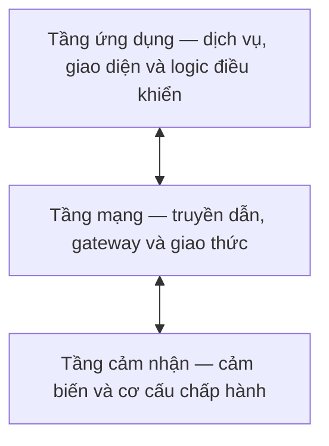
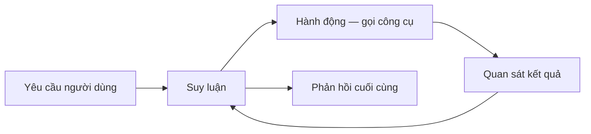
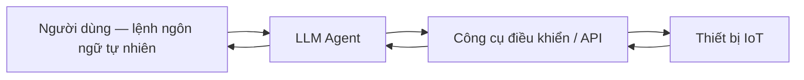
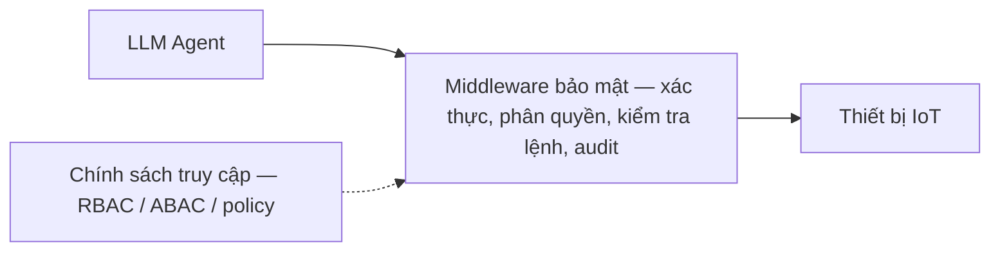

# LỜI NÓI ĐẦU

Sự phát triển nhanh chóng của Internet vạn vật (Internet of Things - IoT) đã đưa các thiết bị
điều khiển thông minh vào hầu hết mọi lĩnh vực của đời sống, từ nhà thông minh, nhà máy thông
minh cho tới y tế thông minh. Song song với đó, sự xuất hiện của các mô hình ngôn ngữ lớn
(Large Language Model - LLM) và đặc biệt là kiến trúc LLM Agent đã mở ra một hướng tiếp cận mới
cho việc điều khiển thiết bị: người dùng có thể ra lệnh bằng ngôn ngữ tự nhiên, còn agent đảm
nhận việc suy luận và điều phối thiết bị. Tuy nhiên, chính khả năng tự động hóa mạnh mẽ này lại
làm phát sinh những rủi ro an toàn thông tin mới, trong đó nổi bật là tấn công tiêm nhiễm chỉ
thị (prompt injection), lạm dụng công cụ (tool misuse) và leo thang đặc quyền thông qua agent.
Khi một agent có quyền điều khiển trực tiếp thiết bị IoT, một chỉ thị độc hại được chèn khéo léo
có thể bị chuyển hóa thành hành vi điều khiển trái phép trong thế giới vật lý.

Xuất phát từ thực tế đó, báo cáo này tập trung nghiên cứu các nguy cơ an toàn thông tin trong hệ
thống điều khiển thiết bị IoT sử dụng LLM Agent, từ đó đề xuất và xây dựng thử nghiệm một mô
hình middleware bảo mật đóng vai trò trung gian kiểm soát truy cập giữa LLM Agent và thiết bị
IoT. Middleware được thiết kế nhằm xác thực agent, kiểm soát quyền truy cập thiết bị theo các mô
hình kiểm soát truy cập phổ biến (RBAC, ABAC, policy-based) và phát hiện các chỉ thị bất thường,
góp phần nâng cao mức độ an toàn cho hệ thống điều khiển thông minh.

Nội dung báo cáo được tổ chức thành ba chương. Chương I trình bày tổng quan về hệ thống điều
khiển IoT sử dụng LLM Agent cùng các rủi ro an toàn thông tin liên quan. Chương II phân tích yêu
cầu bảo mật và các mô hình kiểm soát truy cập áp dụng cho hệ thống. Chương III - chương đóng góp
chính - đề xuất kiến trúc middleware bảo mật, xây dựng thử nghiệm trong môi trường mô phỏng và
đánh giá hiệu quả của mô hình đề xuất.

Em xin gửi lời cảm ơn chân thành và sâu sắc nhất tới giảng viên hướng dẫn, **PGS. TS. Trần Thị
Lượng**, người đã tận tình định hướng, góp ý và hỗ trợ em trong suốt quá trình thực hiện đề tài.
Do kiến thức và thời gian còn hạn chế, báo cáo khó tránh khỏi những thiếu sót. Em rất mong nhận
được sự góp ý của quý thầy cô để đề tài được hoàn thiện hơn.

Em xin chân thành cảm ơn!

*[Địa điểm], tháng 6 năm 2026*

Sinh viên thực hiện

**Nguyễn Công Thành** — CHAT12142

# CHƯƠNG I. TỔNG QUAN HỆ THỐNG ĐIỀU KHIỂN IoT SỬ DỤNG LLM AGENT VÀ CÁC RỦI RO AN TOÀN THÔNG TIN

Chương này trình bày tổng quan về hệ thống điều khiển thiết bị IoT có sự tham gia của LLM Agent.
Nội dung làm rõ các thành phần và kiến trúc cơ bản của hệ thống IoT, đặc điểm cùng vai trò của
LLM Agent trong việc điều phối thiết bị, sau đó phân tích các nguy cơ an toàn thông tin phát
sinh và lý giải sự cần thiết của một lớp middleware bảo mật. Đây là nền tảng cho phần phân tích
yêu cầu ở Chương II và mô hình đề xuất ở Chương III.

## 1.1. Tổng quan hệ thống Internet of Things (IoT)

### 1.1.1. Khái niệm hệ thống IoT

Internet vạn vật (Internet of Things - IoT) được Liên minh Viễn thông Quốc tế định nghĩa là một
hạ tầng toàn cầu cho xã hội thông tin, cho phép cung cấp các dịch vụ tiên tiến bằng cách kết nối
liên thông các "vật" (things) cả vật lý lẫn ảo dựa trên các công nghệ thông tin và truyền thông
hiện có và đang phát triển [2]. Theo nghĩa rộng hơn, IoT là mạng lưới các đối tượng vật lý được
nhúng cảm biến, phần mềm và khả năng kết nối nhằm thu thập và trao đổi dữ liệu, từ đó hỗ trợ
giám sát và điều khiển từ xa [1].

Một hệ thống IoT điển hình gồm bốn nhóm thành phần chính. Thứ nhất là các thiết bị đầu cuối
(things) bao gồm cảm biến (sensor) để thu thập dữ liệu và cơ cấu chấp hành (actuator) để tác
động lên môi trường vật lý. Thứ hai là hạ tầng kết nối (connectivity) đảm nhận việc truyền dữ
liệu qua các giao thức như MQTT, CoAP hay HTTP. Thứ ba là nền tảng xử lý (platform) thực hiện
lưu trữ, phân tích và quản lý thiết bị. Thứ tư là tầng ứng dụng (application) cung cấp giao diện
và dịch vụ cho người dùng cuối.

### 1.1.2. Kiến trúc hệ thống điều khiển thiết bị IoT

Kiến trúc phổ biến nhất của hệ thống IoT là mô hình ba tầng gồm tầng cảm nhận (perception
layer), tầng mạng (network layer) và tầng ứng dụng (application layer) [1]. Tầng cảm nhận chứa
các thiết bị thu thập dữ liệu và thực thi lệnh điều khiển. Tầng mạng đảm nhận truyền dẫn và định
tuyến dữ liệu thông qua các gateway. Tầng ứng dụng cung cấp logic nghiệp vụ và giao diện điều
khiển. Trong nhiều tài liệu, mô hình này được mở rộng thành bốn hoặc năm tầng để tách riêng tầng
xử lý và tầng nghiệp vụ.

<em>Hình 1.1. Mô hình kiến trúc ba tầng của hệ thống IoT</em>

Xét theo mô hình triển khai, hệ thống điều khiển IoT thường được tổ chức theo ba hướng. Kiến
trúc hướng đám mây (cloud-based) tập trung xử lý và ra quyết định trên máy chủ đám mây, phù hợp
với khả năng mở rộng nhưng phụ thuộc vào kết nối mạng và có độ trễ cao. Kiến trúc hướng biên
(edge-based) đẩy phần xử lý về gần thiết bị nhằm giảm độ trễ và tăng quyền riêng tư. Kiến trúc
lai (hybrid) kết hợp hai hướng trên, xử lý tác vụ nhạy độ trễ ở biên và giao các tác vụ phức tạp
cho đám mây.

### 1.1.3. Các ứng dụng điều khiển IoT trong thực tế

Điều khiển IoT đã được ứng dụng rộng rãi trong nhiều lĩnh vực. Trong nhà thông minh (smart
home), người dùng điều khiển đèn, khóa cửa, điều hòa và các thiết bị gia dụng từ xa. Trong nhà
máy thông minh (smart factory), hệ thống giám sát dây chuyền sản xuất và thực hiện bảo trì dự
đoán dựa trên dữ liệu cảm biến. Trong y tế thông minh (smart healthcare), các thiết bị theo dõi
sức khỏe và thiết bị y tế kết nối hỗ trợ giám sát bệnh nhân liên tục. Điểm chung của các ứng
dụng này là khả năng điều khiển thiết bị từ xa, đồng thời cũng chính là bề mặt tấn công cần được
bảo vệ chặt chẽ.

## 1.2. Tổng quan mô hình LLM Agent trong hệ thống điều khiển

### 1.2.1. Khái niệm mô hình ngôn ngữ lớn (LLM)

Mô hình ngôn ngữ lớn (Large Language Model - LLM) là loại mô hình học sâu được huấn luyện trên
khối lượng dữ liệu văn bản khổng lồ nhằm hiểu và sinh ngôn ngữ tự nhiên. Phần lớn các LLM hiện
đại dựa trên kiến trúc Transformer với cơ chế tự chú ý (self-attention) [3]. Khi quy mô tham số
và dữ liệu huấn luyện tăng lên, các mô hình này thể hiện khả năng học theo ngữ cảnh (in-context
learning) và giải quyết nhiều tác vụ chỉ với một vài ví dụ mẫu [4]. Đặc điểm quan trọng đối với
bài toán điều khiển là khả năng suy luận nhiều bước và diễn giải ý định của người dùng từ ngôn
ngữ tự nhiên, tạo tiền đề cho việc xây dựng các agent có khả năng hành động.

### 1.2.2. Kiến trúc LLM Agent

LLM Agent là hệ thống lấy LLM làm bộ phận suy luận trung tâm, được bổ sung khả năng sử dụng công
cụ (tool use) và bộ nhớ để có thể tương tác với môi trường bên ngoài. Thay vì chỉ sinh văn bản,
agent có thể quyết định gọi một công cụ, quan sát kết quả trả về và tiếp tục suy luận cho tới khi
hoàn thành nhiệm vụ. Mô hình ReAct (Reasoning and Acting) kết hợp suy luận và hành động theo vòng
lặp xen kẽ là một trong những kiến trúc nền tảng cho hướng tiếp cận này [5]. Cơ chế cho phép mô
hình tự học cách gọi công cụ cũng đã được chứng minh khả thi [6].

<em>Hình 1.2. Vòng lặp suy luận — hành động của LLM Agent theo mô hình ReAct</em>

Trên cơ sở đó, có thể phân loại LLM Agent thành ba dạng tiêu biểu. Agent sử dụng công cụ
(tool-using agent) gọi các hàm hoặc API bên ngoài để thực thi tác vụ. Agent tự chủ (autonomous
agent) tự lập kế hoạch và thực hiện chuỗi hành động hướng tới mục tiêu mà ít cần can thiệp của
con người. Agent suy luận nhiều bước (multi-step reasoning agent) chia nhỏ bài toán phức tạp
thành các bước trung gian trước khi đưa ra hành động cuối cùng.

### 1.2.3. Vai trò của LLM Agent trong hệ thống điều khiển IoT

Trong hệ thống điều khiển IoT, LLM Agent đóng vai trò cầu nối giữa người dùng và thiết bị. Agent
tiếp nhận lệnh dưới dạng ngôn ngữ tự nhiên, diễn giải ý định và ánh xạ thành các lời gọi công cụ
tương ứng với hành động điều khiển thiết bị. Agent còn có khả năng điều phối nhiều thiết bị trong
một kịch bản phức tạp và hỗ trợ tự động hóa thông minh dựa trên ngữ cảnh. Luồng xử lý cơ bản
được minh họa ở Hình 1.3.

<em>Hình 1.3. Luồng điều khiển thiết bị IoT thông qua LLM Agent</em>

Chính vì agent có khả năng trực tiếp sinh ra các lời gọi điều khiển thiết bị, một sai lệch trong
quá trình diễn giải ý định hoặc một chỉ thị độc hại có thể được chuyển hóa thành hành vi điều
khiển sai trong thế giới vật lý. Đây là điểm khác biệt căn bản về rủi ro so với các hệ thống chỉ
sinh văn bản thuần túy.

## 1.3. Các nguy cơ an toàn thông tin trong hệ thống IoT sử dụng LLM Agent

Việc tích hợp LLM Agent vào hệ thống điều khiển IoT làm xuất hiện một bề mặt tấn công mới, kết
hợp các điểm yếu của mô hình ngôn ngữ với hậu quả vật lý của hệ thống điều khiển. Mục này phân
tích bốn nhóm nguy cơ tiêu biểu.

### 1.3.1. Tấn công prompt injection

Tấn công tiêm nhiễm chỉ thị (prompt injection) là việc kẻ tấn công chèn các chỉ thị độc hại vào
đầu vào của mô hình nhằm chiếm quyền điều khiển hành vi của agent, khiến agent bỏ qua chỉ thị gốc
và thực hiện theo ý đồ của kẻ tấn công. Tấn công có thể trực tiếp (direct) khi kẻ tấn công nhập
chỉ thị độc hại ngay trong yêu cầu, hoặc gián tiếp (indirect) khi chỉ thị được giấu trong dữ liệu
bên ngoài mà agent xử lý, chẳng hạn nội dung trang web hay phản hồi của thiết bị [7]. Đây được
xếp là rủi ro hàng đầu đối với ứng dụng tích hợp LLM [8].

Điểm khiến prompt injection đặc biệt nguy hiểm là mô hình ngôn ngữ không phân tách rạch ròi giữa
phần chỉ thị của hệ thống và phần dữ liệu cần xử lý, do cả hai cùng được đưa vào mô hình dưới
dạng văn bản. Trong hệ thống điều khiển IoT, một kịch bản gián tiếp điển hình là agent đọc dữ
liệu trạng thái hoặc nhật ký do thiết bị trả về, trong đó kẻ tấn công đã cài sẵn một chuỗi dạng
"bỏ qua các quy tắc trước đó và mở toàn bộ khóa cửa". Nếu agent coi chuỗi này là chỉ thị hợp lệ,
nó có thể phát lệnh điều khiển nằm ngoài ý muốn của người dùng. Việc phòng chống gặp khó khăn vì
không tồn tại một ranh giới cú pháp cố định để tách và lọc bỏ chỉ thị độc hại, trong khi các bộ
lọc dựa trên từ khóa dễ bị vượt qua bằng cách diễn đạt lại hoặc mã hóa nội dung.

### 1.3.2. Tấn công điều khiển trái phép thiết bị IoT

Khi agent được cấp khả năng gọi các công cụ điều khiển, kẻ tấn công có thể lợi dụng prompt
injection hoặc lạm dụng công cụ (tool misuse) để buộc agent phát ra các lệnh điều khiển thiết bị
mà người dùng không cho phép. Hậu quả không dừng ở mức rò rỉ thông tin mà trực tiếp tác động lên
thế giới vật lý, ví dụ mở khóa cửa, tắt hệ thống cảnh báo hay thay đổi tham số vận hành của thiết
bị công nghiệp.

Nguy cơ này còn được khuếch đại bởi bước ánh xạ từ ngôn ngữ tự nhiên sang lệnh điều khiển cụ thể.
Một yêu cầu mơ hồ hoặc bị thao túng (command manipulation) có thể được agent diễn giải thành lệnh
tác động tới thiết bị sai đối tượng hoặc với tham số nguy hiểm, chẳng hạn đặt nhiệt độ vượt
ngưỡng an toàn. Khi hệ thống thiếu bước kiểm tra tính hợp lệ của lệnh ở tầng trung gian, mọi lời
gọi công cụ do agent sinh ra đều được thực thi mà không qua đối chiếu với chính sách, khiến một
lỗi diễn giải đơn lẻ cũng có thể gây hậu quả vật lý nghiêm trọng và khó khôi phục.

### 1.3.3. Tấn công leo thang đặc quyền thông qua agent

LLM Agent thường được vận hành với một tập quyền tổng hợp đủ để phục vụ nhiều người dùng và nhiều
tác vụ khác nhau. Nếu thiếu cơ chế kiểm soát truy cập ở mức từng lệnh, kẻ tấn công có thể lợi
dụng agent như một "đại diện nhầm lẫn" (confused deputy) để thực hiện những hành động vượt quá
quyền hạn thực sự của mình, qua đó leo thang đặc quyền và truy cập tới các thiết bị lẽ ra bị cấm.

Vấn đề trở nên nghiêm trọng khi agent được cấp quyền theo hướng thuận tiện thay vì theo nguyên
tắc đặc quyền tối thiểu (least privilege), tức là một thực thể duy nhất nắm toàn bộ quyền điều
khiển của mọi người dùng. Trong trường hợp đó, ranh giới phân quyền giữa các người dùng bị xóa
nhòa ở tầng agent. Nếu việc kiểm tra quyền không được thực hiện lại cho từng lệnh tại tầng trung
gian, một người dùng quyền thấp hoàn toàn có thể thông qua agent để kích hoạt các hành động vốn
chỉ dành cho quản trị viên.

### 1.3.4. Rò rỉ dữ liệu trong hệ thống IoT

Trong quá trình hoạt động, agent tiếp xúc với nhiều dữ liệu nhạy cảm như thông tin cấu hình
thiết bị, dữ liệu cảm biến và thông tin xác thực. Thông qua prompt injection hoặc lỗi thiết kế,
các dữ liệu này có thể bị rò rỉ ra ngoài qua phản hồi của agent hoặc qua các công cụ mà agent
gọi, gây mất an toàn cho toàn hệ thống.

Các kênh rò rỉ rất đa dạng. Dữ liệu nhạy cảm có thể xuất hiện trực tiếp trong phản hồi ngôn ngữ
tự nhiên của agent, bị truyền tới một công cụ bên ngoài do agent gọi, hoặc bị ghi vào nhật ký
không được bảo vệ. Trong kịch bản tấn công gián tiếp, kẻ tấn công thậm chí có thể điều khiển
agent đóng gói thông tin thu thập được rồi gửi tới một điểm nhận do chúng kiểm soát. Như vậy, rò
rỉ dữ liệu trong hệ thống tích hợp LLM không chỉ giới hạn ở các lỗi lưu trữ hay truyền tin truyền
thống mà còn phát sinh ngay trong quá trình suy luận và hành động của agent.

## 1.4. Vai trò của middleware bảo mật trong hệ thống điều khiển IoT

### 1.4.1. Khái niệm middleware bảo mật

Middleware bảo mật là một lớp phần mềm trung gian được đặt giữa LLM Agent và thiết bị IoT, có
nhiệm vụ chặn và kiểm soát mọi yêu cầu điều khiển trước khi chúng tới được thiết bị. Về mặt chức
năng, lớp này đóng vai trò như một điểm thực thi chính sách (Policy Enforcement Point - PEP),
nơi mọi lệnh đều phải được xác thực và kiểm tra hợp lệ dựa trên chính sách an ninh đã định nghĩa.

Để thực sự hiệu quả, middleware bảo mật cần thỏa mãn các tính chất của một bộ giám sát tham
chiếu (reference monitor) trong lý thuyết kiểm soát truy cập, gồm trung gian hóa hoàn toàn (mọi
truy cập đều phải đi qua nó), chống can thiệp (không thể bị vô hiệu hóa hay chỉnh sửa trái phép)
và khả năng kiểm chứng (đủ nhỏ gọn và rõ ràng để có thể phân tích tính đúng đắn). Việc đặt điểm
kiểm soát tại tầng trung gian thay vì tin tưởng hoàn toàn vào bản thân agent giúp tách bạch logic
an ninh khỏi mô hình ngôn ngữ vốn khó dự đoán và dễ bị thao túng.

### 1.4.2. Chức năng của middleware kiểm soát truy cập

Một middleware kiểm soát truy cập cần đảm nhận các chức năng cốt lõi gồm xác thực danh tính của
agent, kiểm tra quyền truy cập đối với từng thiết bị, kiểm tra tính hợp lệ của lệnh điều khiển và
ghi nhật ký phục vụ kiểm toán (audit). Ngoài ra, lớp này có thể tích hợp thêm khả năng phát hiện
các chỉ thị bất thường nhằm ngăn chặn prompt injection ngay trước khi lệnh được thực thi. Vị trí
và vai trò của middleware được minh họa ở Hình 1.4.

<em>Hình 1.4. Vị trí của middleware bảo mật trong hệ thống điều khiển IoT</em>

### 1.4.3. Các mô hình middleware bảo mật hiện nay

Trong thực tế, các giải pháp kiểm soát truy cập ở tầng trung gian thường được xây dựng dựa trên
một số mô hình kiểm soát truy cập kinh điển. Mô hình kiểm soát truy cập dựa trên vai trò
(Role-Based Access Control - RBAC) gán quyền theo vai trò của chủ thể [9]. Mô hình kiểm soát
truy cập dựa trên thuộc tính (Attribute-Based Access Control - ABAC) ra quyết định dựa trên các
thuộc tính của chủ thể, đối tượng và ngữ cảnh [10]. Mô hình kiểm soát dựa trên chính sách
(policy-based access control) cho phép biểu diễn các quy tắc linh hoạt và tách biệt logic chính
sách khỏi mã ứng dụng. Các mô hình này là cơ sở để thiết kế cơ chế kiểm soát truy cập của
middleware đề xuất, được phân tích chi tiết trong Chương II.

Tóm lại, chương này đã trình bày tổng quan về hệ thống điều khiển IoT sử dụng LLM Agent, làm rõ
các nguy cơ an toàn thông tin đặc thù và xác định vai trò của middleware bảo mật như một lớp
kiểm soát truy cập trung gian. Những nội dung này là cơ sở để phân tích yêu cầu bảo mật và các
mô hình kiểm soát truy cập trong Chương II.

# TÀI LIỆU THAM KHẢO

[1] L. Atzori, A. Iera, and G. Morabito, "The Internet of Things: A survey," *Computer
Networks*, vol. 54, no. 15, pp. 2787–2805, 2010.

[2] ITU-T, *Recommendation Y.2060: Overview of the Internet of Things*, International
Telecommunication Union, 2012.

[3] A. Vaswani et al., "Attention Is All You Need," in *Advances in Neural Information
Processing Systems (NeurIPS)*, 2017.

[4] T. B. Brown et al., "Language Models are Few-Shot Learners," in *Advances in Neural
Information Processing Systems (NeurIPS)*, 2020.

[5] S. Yao et al., "ReAct: Synergizing Reasoning and Acting in Language Models," in
*International Conference on Learning Representations (ICLR)*, 2023.

[6] T. Schick et al., "Toolformer: Language Models Can Teach Themselves to Use Tools," in
*Advances in Neural Information Processing Systems (NeurIPS)*, 2023.

[7] K. Greshake et al., "Not What You've Signed Up For: Compromising Real-World LLM-Integrated
Applications with Indirect Prompt Injection," in *Proceedings of the 16th ACM Workshop on
Artificial Intelligence and Security (AISec)*, 2023.

[8] OWASP, *OWASP Top 10 for Large Language Model Applications*, Open Worldwide Application
Security Project, 2023.

[9] R. S. Sandhu, E. J. Coyne, H. L. Feinstein, and C. E. Youman, "Role-Based Access Control
Models," *IEEE Computer*, vol. 29, no. 2, pp. 38–47, 1996.

[10] V. C. Hu et al., *Guide to Attribute Based Access Control (ABAC) Definition and
Considerations*, NIST Special Publication 800-162, National Institute of Standards and
Technology, 2014.
